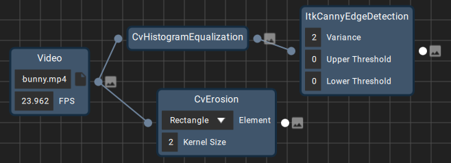
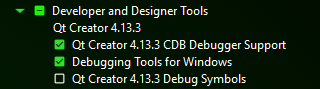
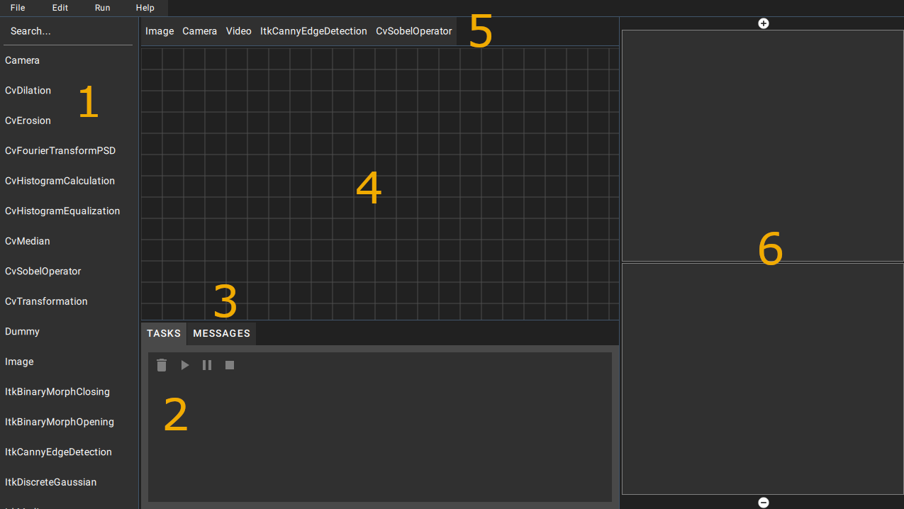
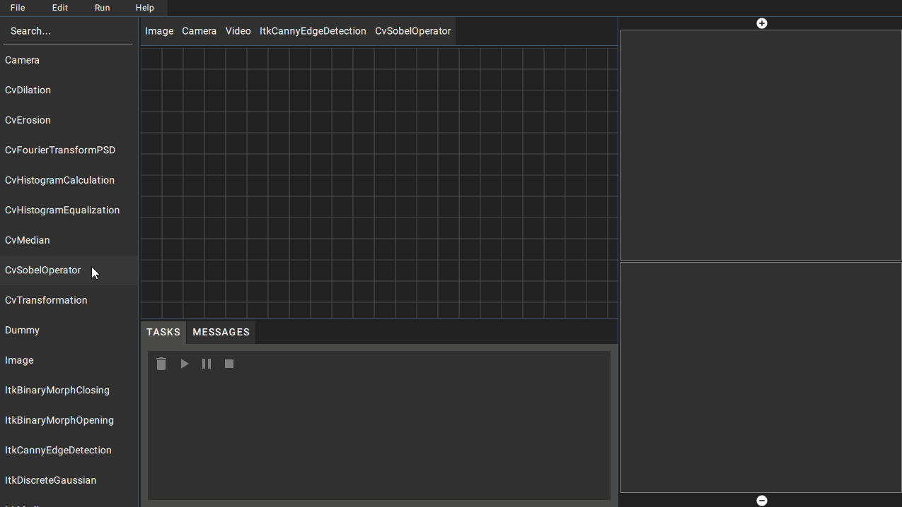
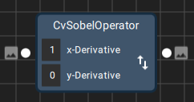
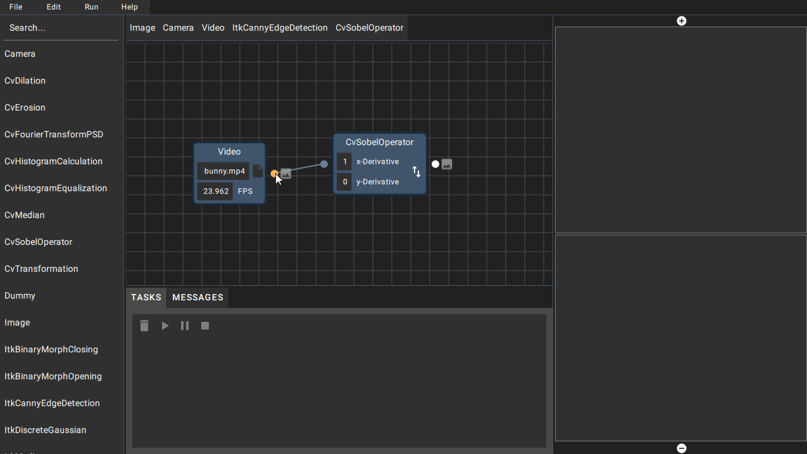
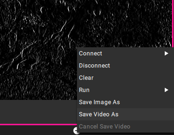
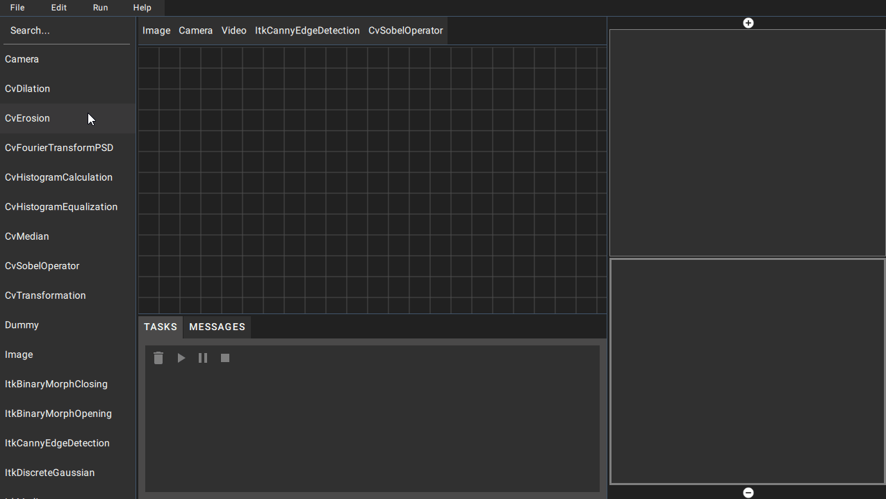

<p align="center">
    
    
    
    
</p>

<h1 align="center">
    Graph-ICS
</h1>

<p align="center">
    
</p>

<p align="center">
    A Node-Based Image, Video and Data Processing Tool
</p>

<p align="center">
    
</p>

# Content

- [Overview](#overview)
- [Installation](#installation)
  - [Using the Installer](#using-the-installer)
  - [Building from Source](#building-from-source)
- [Quick Start](#quick-start)
  - [User](#user)
  - [Developer](#developer)
- [References](#references)

# Overview

Graph-ICS is a tool for visualizing and creating image, video, and data streams. A stream always consists of an input and a series of filter nodes. Graph-ICS provides out-of-the-box usage of many filtering algorithms from the libraries **[ITK](https://itk.org/)**, **[OpenCV](https://opencv.org/)**, and **[Qt](https://qt.io/)**. Up to 10 different streams can be processed and displayed simultaneously. A core concept of Graph-ICS is to give its users the freedom to easily extend the available nodes for their desired use-case.

# Installation

## Using the Installer

- Go to the [Releases](https://github.com/Graph-ICS/Graph-ICS/releases/latest) section and download the installer for your platform.
- You can find an installer for **Windows**, **MacOS**, and **Linux**.
- Extract the content and run the executable.

### A Note on Compatibility

The linux binary for Graph-ICS was built and tested on Ubuntu 18.04 LTS. According to [linuxdeployqt](https://github.com/probonopd/linuxdeployqt#a-note-on-binary-compatibility) the binary should also work on newer systems and different distributions.

I tried running the binary on [EndeavourOS](https://endeavouros.com/) (Arch-based), but did **not** get it to work.

The distributed mac binary was built on macOSX High Sierra 10.13.6 and cannot run on older systems.

**If the Graph-ICS binary doesn't run on your system you can always [build from source](#building-from-source)!**

## Building from Source

If you encounter a problem anywhere in the process look up [Troubleshooting](#troubleshooting)! Maybe the problem has already been solved for you :)

**Worth Mentioning:**

The guide walks thorugh the steps on how to build Graph-ICS for the *Debug* configuration. You just need to replace *Debug* with *Release* in all following commands to produce the *Release* configuration.

### Step-by-step

- [Install Git](#install-git)
- [Install Build Tools](#install-build-tools)
- [Install CMake](#install-cmake)
- [Install Qt Library and QtCreator](#install-qt-library-and-qtcreator)
- [Build OpenCV](#build-opencv)
- [Build ITK](#build-itk)
- [Build Graph-ICS](#build-graph-ics)
- [Develop via QtCreator](#develop-via-qtcreator)
- [Plugins, Examples and Documentation (optional)](#plugins-examples-and-documentation-optional)
- [Troubleshooting](#troubleshooting)

### Install Git

- Download and install Git from the [official website](https://git-scm.com/downloads) or via your package manager.

### Install Build Tools

**Windows:**

- Download and install Visual Studio Community 2019 from [here](https://visualstudio.microsoft.com/downloads/).
- Install Windows 10 SDK for C++ using the Visual Studio Installer.
- Make sure the compiler tools are in your *PATH*.
- e.g. *C:\Program Files (x86)\Microsoft Visual Studio\2019\Community\VC\Tools\MSVC\14.29.30133\bin\Hostx64\x64*

**Linux:**

- Install *gcc*, *g++* and *make* packages.

e.g. on *Ubuntu* use:

```sh
$ sudo apt install gcc g++ make
```

**MacOS:**

- Download and install XCode using the AppStore.

### Install CMake

- Go to the official [CMake download website](https://cmake.org/download/).
- Select the binary distributions of the latest relase for your platform.
- Make sure you have a CMake version greater than **3.14** installed.

**Note:** On Linux you can also install CMake via your package manager.

Make sure *cmake* runs from the commandline and check your version:

```sh
$ cmake --version
```

### Install Qt Library and QtCreator

- Download the [Qt Online Installer](https://www.qt.io/download) for open-source.
- We need **Qt 5.15.2**.
- Make sure to install the binaries for the compiler you use (e.g. on Windows using Visual Studio Community 2019: *MSVC2019*, on Linux/MacOS: *Desktop gcc*).
- Make sure to install all Qt Modules to have no dependency issues.

**Windows:**

- Additionally install *Qt Creator CDB Debugger Support* and *Debugging Tools for Windows*.

<p align="center">
    
</p>

### Build OpenCV

- Open a commandline window.
- *cd* to a location where you want to store the library (e.g. *C:/Libraries/*) and execute the following commands.
- Pay close attention to the commands and execute them in the specified order!
  
**Do not choose a path wich is too long! CMake paths are restricted to 50 characters by default.**

```sh
$ mkdir opencv && cd opencv
$ git clone https://github.com/opencv/opencv.git src && cd src
$ git checkout tags/4.5.5 -b 4.5.5 && cd ..
$ mkdir build-4.5.5 && cd build-4.5.5
```

In the following you will see the ```-j8``` option. This is to speed up the build by a large factor. Replace *8* with the number of threads your CPU supports.

Inside the */opencv/build-4.5.5* directory execute:

**Windows:**

```sh
$ cmake ../src -DWITH_FFMPEG=ON
$ cmake --build . -j8 --config Debug
```

**Linux:**

Before configuring OpenCV you need to make sure to have all needed packages installed.

To install the dependencies on Ubuntu run:

```sh
$ sudo apt install pkg-config ffmpeg libavcodec-dev libavformat-dev libavutil-dev libswscale-dev libavresample-dev mesa-common-dev libglu1-mesa-dev
```

```sh
$ mkdir Debug && cd Debug
$ cmake ../../src -DCMAKE_BUILD_TYPE=Debug -DWITH_FFMPEG=ON
```

Make sure that OpenCV finds *FFMPEG* and the output in the *Video I/O* section looks something like this:

```sh
Video I/O:
--     DC1394:                      NO
--     FFMPEG:                      YES
--       avcodec:                   YES (57.107.100)
--       avformat:                  YES (57.83.100)
--       avutil:                    YES (55.78.100)
--       swscale:                   YES (4.8.100)
--       avresample:                YES (3.7.0)
```

```sh
cmake --build . -j8
```

**MacOS:**

```sh
$ mkdir Debug && cd Debug
$ cmake ../../src -DCMAKE_BUILD_TYPE=Debug
$ cmake --build . -j8
```

### Build ITK

- **Only configure and start the build after OpenCV has finished.**
- I know the build process takes long but you can grab a hot drink :coffee: and enjoy some fresh air while waiting :)
- The next steps will seem familiar to you.
- Open a commandline window.
- *cd* to a location where you want to store the library and execute the following commands.
- Pay close attention to the commands and execute them in the specified order!

**Do not choose a path wich is too long! CMake paths are restricted to 50 characters by default.**

```sh
$ mkdir itk && cd itk
$ git clone https://github.com/InsightSoftwareConsortium/ITK.git src && cd src
$ git checkout tags/v5.2.1 -b v5.2.1 && cd ..
$ mkdir build-v5.2.1 && cd build-v5.2.1
```

Make sure to adjust the path for the ```OpenCV_DIR``` option depending on your OpenCV build directory.

ITK has a known issue in *v5.2.1* regarding the *VideoBridgeOpenCV* module and the testing of it. ITK will only compile successfully without testing so we need to specify the ```-DBUILD_TESTING=OFF``` option to build without errors.

Inside the */itk/build-v5.2.1* directory execute:

**Windows:**

```sh
$ cmake ../src -DOpenCV_DIR=<your path to>/opencv/build-4.5.5 -DModule_ITKVideoBridgeOpenCV=ON -DBUILD_TESTING=OFF
$ cmake --build . -j8 --config Debug
```

**Linux and MacOS:**

```sh
$ mkdir Debug && cd Debug
$ cmake ../../src -DCMAKE_BUILD_TYPE=Debug -DOpenCV_DIR=<your path to>/opencv/build-4.5.5/Debug -DModule_ITKVideoBridgeOpenCV=ON -DBUILD_TESTING=OFF
$ cmake --build . -j8
```

### Build Graph-ICS

- Open a commandline window and *cd* to the directory where you want to store Graph-ICS.

```sh
$ git clone https://github.com/Graph-ICS/Graph-ICS.git && cd Graph-ICS
$ mkdir build && cd build
```

Inside the */Graph-ICS/build* directory execute:

```sh
$ mkdir Debug && cd Debug
```

Make sure to adjust the path for the ```Qt5_DIR``` and ```ITK_DIR``` options depending on your Qt and ITK-build directories.

**Windows:**

We need to specify the ```CMAKE_BUILD_TYPE``` to automatically place shared libraries into the directory with the Graph-ICS executable. We also keep *Debug* and *Release* build in seperate directories in contrast to building OpenCV and ITK (on Windows) to import the build easier into QtCreator.

```sh
$ cmake ../.. -DCMAKE_BUILD_TYPE=Debug -DQt5_DIR=<your path to>/Qt/5.15.2/<compiler>/lib/cmake/Qt5 -DITK_DIR=<your path to>/itk/build-v5.2.1
$ cmake --build . -j8 --config Debug
```

**Linux and MacOS:**

```sh
$ cmake ../.. -DCMAKE_BUILD_TYPE=Debug -DQt5_DIR=<your path to>/Qt/5.15.2/<compiler>/lib/cmake/Qt5 -DITK_DIR=<your path to>/itk/build-v5.2.1/Debug
$ cmake --build . -j8
```

### Develop via QtCreator

- Start QtCreator and select *Open Project*.
- Find your Graph-ICS source code and select the *CMakeLists.txt*.
- Deselect all kits.
- Select *Import Build From*, enter the location of your *Debug* build and click *Import*.
- Click *Configure Project*.
- Now you should be able to develop Graph-ICS using the QtCreator.

### Plugins, Examples and Documentation (optional)

- [Plugins](plugins/README.md)
- [Examples](examples/README.md)
- [Documentation](docs/README.md)

### Troubleshooting

#### ITK

**Many errors in *itkOpenCV...BridgeTest.cxx* files?**

- I had this issue on Linux and MacOS.
- Building ITK without testing worked for me.
- Append ```-DBUILD_TESTING=OFF``` to the cmake configuration and rebuild.

#### Graph-ICS

**CMake can't find Qt?**

- Try deleting all Qt related CMake cache entries (or your whole build directory) and setting ```Qt5_DIR``` cache variable to: *your path to*/Qt/5.15.2/*your compiler*/lib/cmake/Qt5

**QtCreator shows errors in C++ code after importing the build but compiles without a problem?**

- Try disabling the QtCreator plugin *ClangCodeModel* (worked for me).
- I found the solution in this [stackoverflow post](https://stackoverflow.com/questions/60591719/qt-creator-shows-errors-in-fresh-project-but-code-compiles-fine).

# Quick Start

## User

### Content

- [UI Tour](#ui-tour)
- [Adding Nodes](#adding-nodes)
- [Node Structure](#node-structure)
- [Tasks and Views](#tasks-and-views)
  - [Edit your Video](#edit-your-video)
  - [Save your Image or Video](#save-your-image-or-video)
- [Save your Configurations](#save-your-configurations)
- [Customize your Favoritesbar](#customize-your-favoritesbar)
- [Node Overview](#node-overview)

### UI Tour

<p align="center">
    
</p>

**1:** Searchpanel

- Here you can find all available nodes and query them using the searchbar at the top.
- Drag & drop, doubleclick or use the context menu to create a node (more in [Adding Nodes](#adding-nodes)).

**2:** Tasks

- This area is used to control your defined tasks.
- Read more about Tasks in [Tasks and Views](#tasks-and-views).

**3:** Messages

- Warnings and messages are shown in the *messages-tab*.

**4:** Canvas

- All created nodes will be placed inside the canvas.
- Here you can connect and arrange your nodes to your liking.
- You can use standard editing methods like copy, paste, remove using shortcuts or the *menubar's* *edit* menu

**5:** Favoritesbar

- All your favorite nodes in one place, for quick-access.

**6:** Viewarea

- The output of a stream will be shown in one of the views.
- Connect the output of a node with the view where you want to display your stream.
- You can add and remove views using the buttons above (+) and below (-).
- More about views in [Tasks and Views](#tasks-and-views).

### Adding Nodes

There are several ways to create nodes in Graph-ICS. Nodes can be created in the same way using the *searchpanel* or the *favoritesbar*. You can create nodes via:

- Doubleclick
- Context menu
- Drag & drop

<p align="center">
    
</p>

- Drag & drop a file

Input nodes (*Image* and *Video*) can **also** be created by dragging and dropping a file (e.g. *jpg* or *mp4*) from the file explorer (or desktop) into the *canvas*.

<p align="center">
    
</p>

### Node Structure

<p align="center">
    
</p>

A node can be either an *input* or a *filter*. Available inputs are *Image*, *Video* or *Camera*. *Image* and *Video* represent a file on your system. *Camera* represents a camera device on your system.

A node can have any number of input and output ports (not practical, but possible). Ports can be connected with each other to represent a data flow from one node to the other. Ports always indicate the transfered data with an icon (image or data).

Nodes have attributes to change the parameters of for example a filtering algorithm. You can change the values and check the processed result right after.

### Tasks and Views

*Tasks* and *Views* take a special role in the processing of streams. A stream can only be processed if the output is connected to a view. That is when tasks come into play. A task gets created as soon as the output of a node is connected with a view. The type of the task depends on the input node of the stream. For example a *Video* node as input will always lead to the creation of a video task. The same can be applied to *Camera* and *Image* nodes.

Each view-task relation can be identified by a color.

<p align="center">
    
</p>

After defining your tasks you can control and start processing the stream. You can control your tasks using the global or task specific options. Additionally you can select a view and use the *Run* menu in the *menubar* or the context menu in the *view* to control your task.

<p align="center">
    
</p>

Views can be added and removed using the buttons above (+) and below (-) the *viewarea*. The views to date are *highly inflexible* and *impractical*. This topic will be adressed in a future release!

#### Edit your Video

Videos or camera recordings can be edited (cut, copy, paste) by clicking the *edit* button (pencil icon) at the right side of a video or camera task.

<p align="center">
    
</p>

You can select a range to cut out using the range slider below and select a position to paste frames using the slider above the regular frame slider. Use the buttons at the top to execute or undo/redo your editing.

#### Save your Image or Video

The context menu in a *view* can be used to save your image or video to a file. Also you will be asked to save your video if you recorded a camera stream or edited your video so you don't accidentally loose your progress.

<p align="center">
    
</p>

### Save your Configurations

A node setup with all attribute values and connections can be saved to a config file (.gconfig) to persist your configuration work. You can use standard keyboard shortcuts or the *file* menu in the *menubar* to interact with a configuration.

### Customize your Favoritesbar

To customize your *favoritesbar* you can use the context menu in the *searchpanel* or a node. Also you can *press and hold* an item in the *searchpanel* and drag & drop into the *favoritesbar*. Use the context menu or *press and hold* an item in the *favoritesbar* to move it. Remove nodes from the favorites using the context menu.

<p align="center">
    
</p>

### Node Overview

**Input:**

| Node   | Output          | Functionality                              | Attributes                                                  | Library |
|--------|-----------------|--------------------------------------------|-------------------------------------------------------------|---------|
| Camera | Camera frame    | Grab a frame from the camera device        | **Device:** Camera device number **FPS:** Frames per second | OpenCV  |
| Image  | Image from file | Load the image from the specified file     | **Path:** Path to image file                                | Qt      |
| Video  | Video frame     | Grab a frame from the specified video file | **Path:** Path to video file **FPS:** Frames per second     | OpenCV  |

**Filter:**

| Node                    | Input                                    | Output                          | Functionality                                                                                                                               | Attributes                                                                                                                            | Library   |
|-------------------------|------------------------------------------|---------------------------------|---------------------------------------------------------------------------------------------------------------------------------------------|---------------------------------------------------------------------------------------------------------------------------------------|-----------|
| CvDilation              | Image                                    | Dilated image                   | Dilate the input image                                                                                                                      | **Element:** Dilation Element **Kernel Size:** Size of dilation element (more dilation for larger values)                             | OpenCV    |
| CvErosion               | Image                                    | Eroded image                    | Erode the input image                                                                                                                       | **Element:** Erosion Element **Kernel Size:** Size of erosion element (more erosion for larger values)                                | OpenCV    |
| CvFourierTransformPSD   | Image                                    | PSD image                       | Calculate the phase spectrum density                                                                                                        | **Show Log Amplitude:** Show the logarithmic phase spectrum density                                                                   | OpenCV    |
| CvHistogramCalculation  | Image                                    | Forwarded image, Histogram data | Calculate the histogram                                                                                                                     |                                                                                                                                       | OpenCV    |
| CvHistogramEqualization | Image                                    | Equalized image                 | Stretch histogram data to use all values between 0 and 255 (enhance contrast)                                                               |                                                                                                                                       | OpenCV    |
| CvMedian                | Image                                    | Median blurred image            | Blur the image using the median                                                                                                             | **Kernel Size:** Size of median kernel (larger values for more blur), only odd numbers allowed                                        | OpenCV    |
| CvSobelOperator         | Image                                    | Image with detected edges       | Apply the sobel operator on the image (edge detection)                                                                                      | **x-Derivative:** Edge detection in x-direction **y-Derivative:** Edge detection in y-directon  Both values can't be 0                | OpenCV    |
| CvTransformation        | Image                                    | Transformed image               | Rotate and/or scale the image                                                                                                               |                                                                                                                                       | OpenCV    |
| Dummy                   | Image                                    | Image                           | Forward the input image                                                                                                                     |                                                                                                                                       |  |
| ItkBinaryMorphClosing   | Image                                    | Closed image                    | Closes parts of the image by executing a dilation and a erosion                                                                             | **Radius:** Closing radius (smallest parts to close)                                                                                  | ITK       |
| ItkBinaryMorphOpening   | Image                                    | Opened image                    | Opens parts of the image by executing a erosion and a dilation                                                                              | **Radius:** Opening radius (smallest parts to open)                                                                                   | ITK       |
| ItkCannyEdgeDetection   | Image                                    | Image with detected edges       | Apply a gaussian blur and the canny edge detection algorithm                                                                                | **Variance:** Intensity of the gaussian blur **Upper Threshold:** Largest accepted value **Lower Threshold:** Smallest accepted value | ITK       |
| ItkDiscreteGaussian     | Image                                    | Blurred image                   | Apply a gaussian blur                                                                                                                       | **Variance:** Intensity of the blur                                                                                                   | ITK       |
| ItkMedian               | Image                                    | Median blurred image            | Apply a median blur                                                                                                                         | **x-Radius:** Blur radius in x-direction **y-Radius:** Blur radius in y-direction                                                     | ITK       |
| ItkSubtract             | Image to be subtracted Image to subtract | Subtracted image                | Subtract the smaller image from the larger image,  second connected image gets subtracted from first connected image if they have same size |                                                                                                                                       | ITK       |
| QtBlackWhite            | Image                                    | Black white image               | Transform to black white                                                                                                                    |                                                                                                                                       | Qt        |
| QtDarker                | Image                                    | Darker image                    | Darken the image                                                                                                                            | **Factor:** Darkening factor (values above 100 darken, below 100 lighten)                                                             | Qt        |
| QtLighter               | Image                                    | Lighter image                   | Lighten the image                                                                                                                           | **Factor:** Lightening factor (values above 100 lighten, below 100 darken                                                             | Qt        |

## Developer

Every contribution is appreciated! Make sure to read the [contributing guide](CONTRIBUTING.md) first.

This guide assumes you already have built [Graph-ICS from source](#building-from-source).

### Content

- [Adding a New Filter Node](#adding-a-new-filter-node)
  - [Creating the Class Files using QtCreator](#creating-the-class-files-using-qtcreator)
  - [Implementing the Filter Class](#implementing-the-filter-class)
  - [Registering the Filter](#registering-the-filter)
  - [Creating a Custom Front-End (optional)](#creating-a-custom-front-end-optional)

### Adding a New Filter Node

Graph-ICS aims to keep an open and easy interface to add new filter nodes. The following guide shows the steps that need and also could be done to add a new filter node. The example shows the creation of the *CvSobelOperator* node with a custom front-end.

#### Creating the Class Files using QtCreator

QtCreator quickly generates a nice starting point for filter development and saves you much time writing the class definition.

- Right-click on *app/src/model/opencv* and select *Add New...* .
- Select *C++*, *C++ Class* and click on *choose*.
- Enter a class name, here *CvSobelOperator*.
- Add *Node* as the custom base class and select *Add Q_OBJECT*.
- Click *next*, then *finish*.
- Right-click on the project root and select *Run CMake* (or from the menu *Build/Run CMake*)

#### Implementing the Filter Class

**Header File:**

```c++
#ifndef CVSOBELOPERATOR_H
#define CVSOBELOPERATOR_H

#include "node.h"

// Add to the Graph-ICS Namespace
namespace G 
{
// Derive from Node
class CvSobelOperator : public Node
{
    // Important Q_OBJECT Macro
    Q_OBJECT

public:
    explicit CvSobelOperator();

    // Pure virtual function
    // Filter functionality needs to go in here
    bool retrieveResult() override;
    // Virtual function
    // Define special behavior if an attribute value changed
    void onAttributeValueChanged(Attribute* attribute) override;

private:
    // Declare your in- and out-ports
    // You can have as many as you want and need
    Port m_inPort;
    Port m_outPort;

    // Declare the attributes
    // CvSobelOperator has two attributes to specify the edge detection direction 
    Attribute* m_xDerivative;
    Attribute* m_yDerivative;
};
} // namespace G

#endif // CVSOBELOPERATOR_H
```

**Source File:**

```c++
#include "cvsobeloperator.h"

#include <cv.h>
#include <opencv2/imgproc/imgproc.hpp>

// Wrap the definition into the namspace to avoid writing G::Foo everywhere
namespace G
{
CvSobelOperator::CvSobelOperator()
    // !!!Pass the classname to the Node constructor!!!
    : Node("CvSobelOperator")
    // Initialize the ports with a supported datatype (GIMAGE or GDATA)
    , m_inPort(Port::TYPE::GIMAGE)
    , m_outPort(Port::TYPE::GIMAGE)
    // The Attribute class is really generiy and can be customized to your liking
    // attributeFactory is a prototype factory for predefined Attribute instances
    // For simplicity we just use the predefined IntTextField-Attribute
    , m_xDerivative(attributeFactory.makeIntTextField(1, 0, 2, 1, "x-Derivative"))
    , m_yDerivative(attributeFactory.makeIntTextField(0, 0, 2, 1, "y-Derivative"))
{
    // Register your in-and out-ports to the port system
    registerPorts({&m_inPort}, {&m_outPort});
    // Register your attributes to the attribute system
    registerAttribute("xDerivative", m_xDerivative);
    registerAttribute("yDerivative", m_yDerivative);
}

bool CvSobelOperator::retrieveResult()
{
    try
    {
        // We know that the in-port has an image when entering this function
        cv::Mat& cvImage = m_inPort.getGImage()->getCvMatImage();
        
        // We need to make sure the image has only one channel
        if (cvImage.channels() > 1)
        {
            cv::cvtColor(cvImage, cvImage, CV_BGR2GRAY);
        }

        // Retrieve the values from the attributes to use them in the filtering
        int xDerivative = m_xDerivative->getValue().toInt();
        int yDerivative = m_yDerivative->getValue().toInt();

        // Do the filtering
        cv::Sobel(cvImage, cvImage, CV_8U, xDerivative, yDerivative);
        
        // Forward the result to the out-port
        m_outPort.getGImage()->setImage(cvImage);
    }
    catch (int e)
    {
        qDebug() << "CvSobelOperator. Exception Nr. " << e << '\n';
        return false;
    }

    return true;
}

void CvSobelOperator::onAttributeValueChanged(Attribute* attribute)
{
    // Clear the cached data in the output stream
    // Because an attribute value changed and the result needs to be calculated again  
    clearStreamCache();
    // The specification of the cv::Sobel function does not allow both parameters to be 0
    // This is why this function needs to make sure that the values are never both 0.
    if (attribute->getValue().toInt() == 0)
    {
        Attribute* other;
        if (attribute == m_xDerivative)
        {
            other = m_yDerivative;
        }
        else
        {
            other = m_xDerivative;
        }
        if (other->getValue().toInt() == 0)
        {
            other->setValue(1);
        }
    }
}
} // namespace G
}
```

#### Registering the Filter

- Open *Nodes.cmake* located in *Graph-ICS/app* and add your newly created node to the *OPENCV_NODES* variable

```cmake
set(OPENCV_NODES
    CvDilation
    CvErosion
    CvFourierTransformPSD
    CvHistogramCalculation
    CvHistogramEqualization
    CvMedian
    CvTransformation
    # Our newly added Filter
    CvSobelOperator)
```

Now you just need to run CMake and build Graph-ICS.

#### Creating a Custom Front-End (optional)

You also can customize the node front-end if you don't like the auto generated look or want additional features. As an example we add a button to the node to swap the attribute values.

- Add a new .qml file to *app/qml/node/custom*
- **The file needs to have the exact same name as the filter class (*here: CvSobelOperator*).**

```qml
import QtQuick 2.15
import QtQuick.Layouts 1.15

// Import our Theme
import Theme 1.0

import "../"
import "../attribute"
import "../../components"

// Import the c++ model
import Model.CvSobelOperator 1.0

// GNode provides a Component interface that can be used for customization
// GNode provides all functionality and default Components
GNode {
    id: sobel
    // Instantiate the c++ model and assign it to the model property
    model: CvSobelOperatorModel {}

    // Override the background
    // Do not specitfy size or anchors of the Rectangle, as it will fit to the content
    background: Rectangle {
        color: Theme.primary
        radius: 8
        border.width: 3
        border.color: {
            if (isSelected) {
                return Theme.secondary
            }
            if (isHovered) {
                return Theme.secondaryLight
            }
            return Theme.primaryDark
        }
    }

    // Override the content
    // Everything a sobel contains is inside of the content Component
    // e.g. Title and Attributes
    // Specify a size for this Component if no implicit size is available (e.g. Item)
    // You don't need to use Layouts (but they are convenient for sizing)
    content: ColumnLayout {
        spacing: Theme.smallSpaceing
        // Display the node name (id)
        Text {
            Layout.fillWidth: true
            text: id
            font: Theme.font.body2
            color: Theme.onprimary

            topPadding: Theme.largeSpaceing
            leftPadding: Theme.largeSpaceing
            rightPadding: Theme.largeSpaceing
            bottomPadding: Theme.smallSpaceing
            verticalAlignment: Text.AlignVCenter
            horizontalAlignment: Text.AlignHCenter
        }
        RowLayout {
            Layout.leftMargin: Theme.largeSpaceing
            Layout.rightMargin: Theme.smallSpaceing
            Layout.fillHeight: true
            Item {
                Layout.preferredHeight: xDerivative.height + yDerivative.height
                                        + Theme.smallSpaceing
                Layout.minimumWidth: Math.max(xDerivative.width,
                                              yDerivative.width)
                // Specify the Attributes
                // Custom Attributes that derive from GAttribute can be used too
                TextFieldAttribute {
                    id: xDerivative
                    // make sure to use the exact same name as in registerAttribute(...) (c++)
                    name: "xDerivative"
                    // get the attribute model from the node model by the name
                    node: sobel
                    model: node.model.getAttribute(name)
                    // Don't forget to add the Attributes to the attributes array
                    // Otherwise saving and loading the node will not work properly
                    // It is necessary to use the onCompleted function to push the
                    // attribute into the array, because content is a Component
                    // and the content object is only created during GNode's onCompleted function
                    Component.onCompleted: attributes.push(xDerivative)
                }
                TextFieldAttribute {
                    id: yDerivative
                    anchors.top: xDerivative.bottom
                    anchors.topMargin: Theme.smallSpaceing
                    name: "yDerivative"
                    node: sobel
                    model: node.model.getAttribute(name)
                    Component.onCompleted: attributes.push(yDerivative)
                }
            }
            // Simple demonstration
            // swap the attribute values
            GIconButton {
                Layout.preferredHeight: Theme.baseHeight
                Layout.preferredWidth: Theme.baseHeight

                // Make sure that the attribute values can not be altered if the node is locked
                // Otherwise unexpected behavior may occur if the values are changed
                // while a stream is processing
                enabled: !isLocked

                icon.source: Theme.icon.swapVert
                icon.color: {
                    if (hovered || pressed) {
                        return Theme.primaryDark
                    }
                    return Theme.onprimary
                }

                transparent: true

                onClicked: {
                    let value = xDerivative.value
                    xDerivative.setValue(yDerivative.value)
                    yDerivative.setValue(value)
                }
            }
        }
    }

    // If you just want to create your individual Attributes and don't want to override the content
    // you can just override the predefined attribute Components e.g.:
    // textFieldAttributeComponent: MyCustomTextFieldAttribute {}
}
```

# References

Special thanks :heart: to all open-source projects making life easier for developers all over the world and especially:

- [linuxdeployqt](https://github.com/probonopd/linuxdeployqt)
- [macos-virtualbox](https://github.com/myspaghetti/macos-virtualbox)
- [ScreenToGif](https://github.com/NickeManarin/ScreenToGif)
- [Greenshot](https://github.com/greenshot/greenshot)
- [Big Buck Bunny](https://peach.blender.org/download/) (Example Video)
- [OpenCV](https://github.com/opencv/opencv)
- [ITK](https://github.com/InsightSoftwareConsortium/ITK)
- [Qt](https://qt.io)