Graph-ICS
===

## Content
- [Overview](#overview)
- [Installation](#installation)
- [User Guide](#user-guide)
- [Developer Guide](#developer-guide)
  - [Building Graph-ICS from Source](#building-graph-ics-from-source)
  - [Developing Graph-ICS](#developing-graph-ics)


## Overview

  

Graph-ICS is a software for image processing. It supports image filters using **[ITK](https://itk.org/)** and **[OpenCV](https://opencv.org/)**. Its user interface is based on  **[QML](http://doc.qt.io/qt-5/qtqml-index.html)** and **[QtQuick](http://doc.qt.io/qt-5/qtquick-index.html)**.

The user interface is divided into four parts: the searchpanel on the left, the canvas (drawing area) in the middle, the view area on the right and the statusbar under the Canvas. The User can place nodes on the Canvas via drag&drop from the searchpanel (holds all registered nodes) or from the favoritesbar at the top. Favorites can be added via drag&drop from the searchpanel by pressing and holding an element. Nodes represent input (Image, Video or Camera) and filters.

Nodes can be connected to each other. So they can have input nodes on their left side and output nodes on their right side. Usually there is one input for a chain of filters.

The picture below shows an example:

<center>
	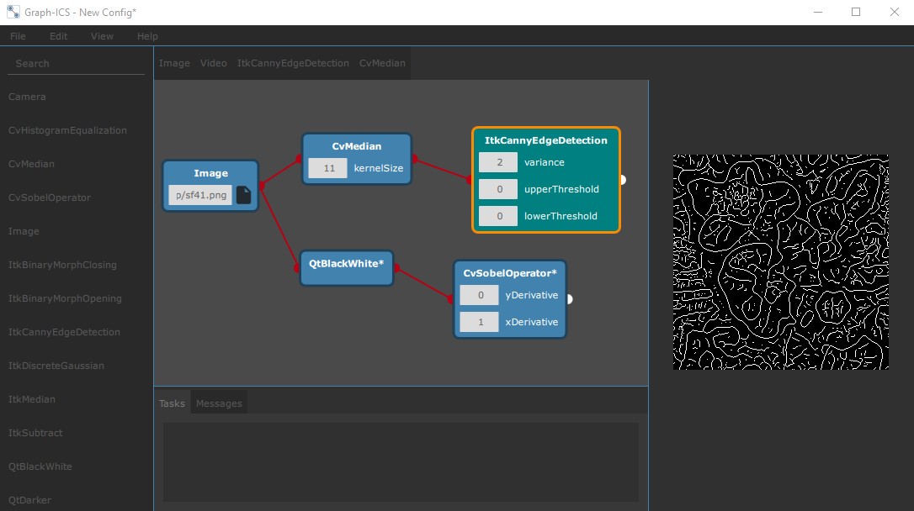
</center>

Via double-click on a node the corresponding output will be calculated and shown on the right side by the view area. The Example above illustrates an example configuration. The Concept of Graph-ICS is to always process Nodes in a reversed order. The double-clicked node asks the predecessor if it has processed data, if not the predecessor asks its predecessor for data and so on. After reaching an input node the data gets processed and transported step-by-step to the double-clicked node.

## Installation

### Installing Graph-ICS using the prebuild binaries

- Navigate to the [Graph-ICS Releases](https://github.com/Graph-ICS/Graph-ICS/releases) and select the latest Release
- Make sure to uninstall any previous Graph-ICS installation using the *Maintanance Tool* in the program directory.
- Download the provided *Graph-ICS_X.X* binray for your platform and run the setup.
- After finishing the Installation process you can run Graph-ICS on your machine.

If there is no Graph-ICS binary available for your platform you can build Graph-ICS on your own following the steps in the [Building Graph-ICS from Source](#building-graph-ics-from-source) guide.

## User Guide

### Add an input-Node

In order to add an input-Node, drag&drop an Item in the SidePanel onto the canvas.
Available input-nodes are Image (.png, .jpg), Video (.mp4) or Camera (Webcam).

### Add and apply filters

After you have created an input you can apply filter on it. Create any filter node as you created the input-node. Then you can start connecting Nodes, by drawing lines from the outputport (right) to the inputport (left) of the node. Next you need to specify where the result of the calculation should be displayed by dragging and dropping from the view. Double-click on a node and the corresponding image will be shown in the connected view. This can also be done if you right-click on the node and select *Show Image* in its context menu. You can add up to 10 different views to teh view area by opening *View/Settings* in the menubar.

<center>
	
</center>

### Remove nodes

Nodes can be removed by right-clicking the node and selecting *Remove Node* from the context-menu. You can also remove nodes with the commands in the Menubar under the *Edit* tab (Keyboard Shortcuts are also available).

<center>
	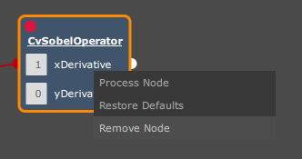
</center>

### Edit several nodes at once

If you want to edit several nodes you can select them by drawing a rectangle on the canvas with your mouse.
The selected nodes will be marked and you can perform different actions on them using the *Edit* menu.

### Manage your configuration

You can open and save a configuration of nodes via the *File* menu. All configuration will be saved. Including the view connection an parameters.

### Customize the Favoritesbar

Graph-ICS allows adding filters to the toolbar. To do so press and hold an Item in the Sidepanel and drag&drop it on the Favoritesbar.

<center>
	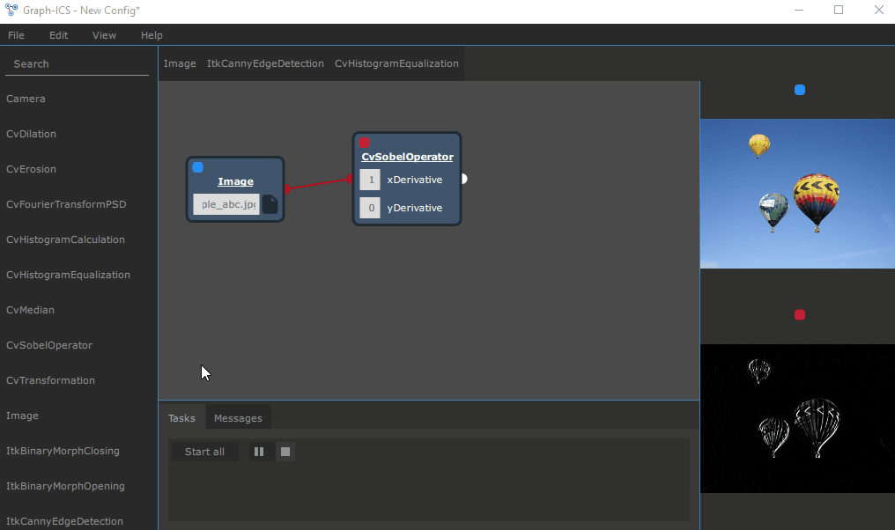
</center>

Create nodes in the same manner as using the Sidepanel

You can remove Nodes from the Favorites by selecting *Remove from Favorites* in the Context-Menu. You can rearrange the items in the Favoritesbar via drag&drop, by pressing and holding an item.

### Statusbar

The Statusbar is made up of Tabs. The Tasks-Tab shows the list of queued node-processing Tasks. If you have queued a Task with a Camera or Video-Node as input, then the Videocontrols appear next to the first element in the Tasklist. You can Pause, Play or Stop the Video.

<center>
	
</center>

The Messages-Tab shows general messages to the user.

## Developer Guide

### Content
- [Building Graph-ICS from Source](#building-graph-ics-from-source)
- [Developing Graph-ICS](#developing-graph-ics)

### Building Graph-ICS from Source

In this guide you will learn step-by-step how you can build, run and debug Graph-ICS from the source code provided in the repository. These steps are only a recommendation on how to build Graph-ICS and are targeting especially beginner developers. Experienced developers may find their own workflow.

#### Prerequisites

**Windows:**
- Visual Studio Installation (we use Visual Studio Community 2019)
- Windows 10 SDK (install via Visual Studio Installer)

<center>
	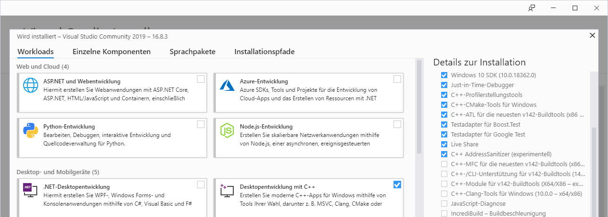
</center>


**Linux:**
- gcc, g++ and make packages 
  - Search for these packages in the package manager your distribution uses (e.g. Ubuntu: ```sudo apt install gcc g++ make```)

**MacOS:**
- XCode installation (you can get it through the AppStore)

#### Step-by-step

1. [Get the Graph-ICS source code](#get-the-graph-ics-source-code)
2. [Install CMake](#install-cmake)
3. [Install Qt Library and Qt Creator](#install-qt-library-and-qt-creator)
4. [Acquire OpenCV binaries](#acquire-opencv-binaries)
5. [Build ITK binaries](#build-itk-binaries)
6. [Configure Qt Creator](#configure-qt-creator)
7. [Build Graph-ICS](#build-graph-ics)

#### Get the Graph-ICS source code

- Get and install [git](https://git-scm.com/downloads) on your system.
- Open the command line in a directory where you want to clone Graph-ICS to.
- Enter the command to download the repository onto your system:
```sh
git clone https://github.com/Graph-ICS/Graph-ICS.git
```
- Now you should have a *Graph-ICS* folder containing the source code.

An alternative way to get the source code without using git is by downloading it from your browser. Click on *clone or download* in the repository and download the code. **This way you will not be able to contribute to Graph-ICS!**

#### Install CMake

- Go to the official [CMake Website](https://cmake.org/download/).
- Select the binary distributions of the latest relase for your platform.
- Start the installer and follow its instructions.
- Finish setup.

**Note:** On Linux you can also install CMake via your package manager or [snapcraft](https://snapcraft.io/). Make sure to have the CMake GUI installed or you will not be able to follow the guide.

#### Install Qt Library and Qt Creator

- Go to https://www.qt.io/download, select *Go open source* and then click *Download*
- Select the path where you want to install Qt (e.g. */home/Qt*, *C:/Qt*). Click next.
- Select the components you want to install, the ones you need are:
- Below *Qt 5.15.2*: 
  - Select the compiler you want to use (e.g. Windows: *MSVC2019*, Linux/MacOS: *Desktop gcc*)
  - Make sure to install all other Qt Modules to have no dependency issues

<center>
	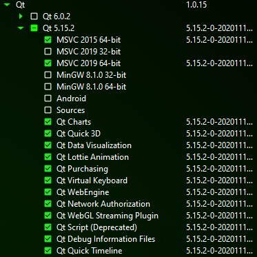
</center>

**Windows:**
- Below *Developer and Designer Tools*: 
  - *Qt Creator CDB Debugger Support* and *Debugging Tools for Windows*

<center>
	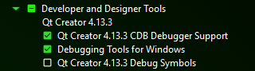
</center>

---

- Finish the installation.

#### Acquire OpenCV binaries

- Go to the Releases page on the [OpenCV Website](https://opencv.org/releases.html)
- find the latest **3.x.x** version:

<center>
	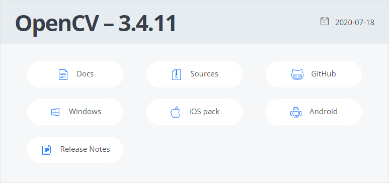
</center>

**Windows:**
There are precompiled binaries available on Windows we recommend using them because building from source consumes more time.
- Download the precompiled Windows binaries. 
- Open the download folder and start the just downloaded *opencv....exe*.
- Set the path where you want to extract the package. We recommend *C:\lib*.
**Note:** Do not choose a path wich is too long because CMake paths are restricted to 50 characters by default.
- Now you have the prebuild binaries for OpenCV

**Linux and MacOS:**
- Download the *Sources*
- Extract the contents of the zipped file into the directory where you want to keep your library (e.g. */home/user/lib/opencv/*).
**Note:** Do not choose a path wich is too long because CMake paths are restricted to 50 characters by default.
- Create a *build* folder next to the *sources*.
- Open the CMake GUI and specify the path to the sources and the path to the build.

<center>
	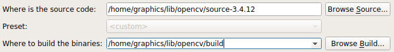
</center>

- Click *Configure* and select *Unix Makefiles* as your generator.
- Click *Configure* until no new red entries appear.
- Click *Generate*.
- Now the makefiles have been generated and you can start the build process.
- Open your commandline directly inside the *build* folder or *cd* to the directory.
- Execute the following command in your commandline (*make* starts the build, the flag *-j8* is to speed up the process).
```sh
make -j8 
```
- Wait until the execution finished.
- You have sucessfully build OpenCV from the source code!

#### Build ITK binaries

**Option A: Download the code from the repository**
- Go to the [ITK GitHub Repository](https://github.com/InsightSoftwareConsortium/ITK) 
- Select the branch *release*. 
- Click on *Code* and select *Download ZIP*
- Extract the the contents from the archive into the directory were you want to store the ITK library (e.g. *C:/lib/itk/*, */home/user/lib/itk/*)

**Option B: Clone the code from the repository**
- You can also clone the repository from GitHub. See [Get the Graph-ICS source code](#get-the-graph-ics-source-code) to get an idea on how to clone the ITK repository.

**Note:** Do not choose a path wich is too long because CMake paths are restricted to 50 characters by default.

- Create a *build* folder next to the *sources*
- Open the CMake GUI and specify the path to the sources and the path to the build.
- Check the *Grouped* and *Advanced* checkboxes below.
- Scroll down to the *Modules* section and check *Module_ITKVideoBridgeOpenCV*.

<center>
	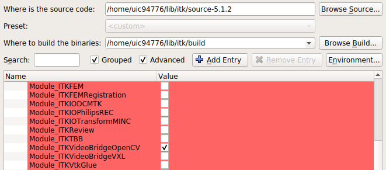
</center>

- Click on *Configure*
- A window will pop up where you need to specify your generator.

**Windows:**

- Specify the generator with your installed Visual Studio Version (e.g. 2019) and make explicitly sure that you build 64bit (x64, Win64) binaries.

<center>
	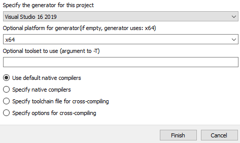
</center>

**Linux and MacOS:**

- Select *Unix Makefiles* as your generator.

---
- Don't panic! The configuration will fail, because you first need to specify your OpenCV directory.
- Specify the path to your OpenCV build into the cache variable *OpenCV_DIR*.

<center>
	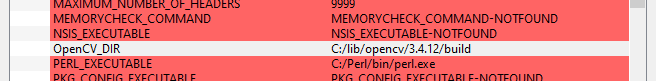
</center>

- Click *Configure* again until no new (red) entries are added.
- Click *Generate*
- Now the makefiles have been generated and you can start the build process.

**Windows:**

- Open the generated solution in your build folder (ITK.sln)
- Wait until Visual Studio starts and the project is initialized. (See blue progress bar below)
- Right-click on *CMakePredefinedTargets/ALL_BUILD* and select *build*. It will take several minutes to complete the process.

**Linux and MacOS:**

- Open your commandline directly inside the *build* folder or *cd* to the directory.
- Execute the following command in your commandline (*make* starts the build, the flag *-j8* is to speed up the process).
```sh
make -j8 
```
---
- If the execution finishes and you see no errors you have successfully compiled the ITK library!

#### Configure Qt Creator

- Open QtCreator, go to *Tools* and click *Options*:
- Select *Kits*.
- Here you have automatically created kits to build your projects.
- Select your prefered kit from the Auto-detected ones and press *Clone*
- optionally rename the cloned kit
- Select the cloned kit and make sure that Qt detects the right compiler

**Windows:**
- Make sure that Qt finds the cdb debugger executable on your machine.
<center>
	
</center>

---
- You can keep the default CMake generator (Ninja) 
- Click *OK* and close the Qt Creator.

#### Build Graph-ICS

- Open Qt Creator and click *Open* on the *Welcome* tab.
- Find the *CMakeLists.txt* in the source code of Graph-ICS and select it.
- Of the shown project configurations select the kit you cloned in the previous step and click *Details*.
- Select *Debug* and *Release* and set a binary folder (build folder), e.g. *C:\Graph-ICS\build*, */home/Graph-ICS/build*

<center>
	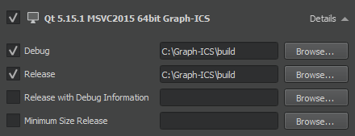
</center>

- Click *configure project*.
- You will see an error regarding ITK.
- Open CMake GUI and specify the source and build paths to your Graph-ICS source and build folders.
- Find the cache entry (red lines) *ITK_DIR* and enter the path to your ITK build directory.
- Click configure until no new entries appear.
- Close the CMake GUI and ignore the warning message.
- Go back to Qt Creator and select *Build/Run CMake* in the menu.

You can now build, run and debug Graph-ICS directly from the Qt Creator using the *hammer* and *play* icons.

### Developing Graph-ICS
Feel free to publish your changes on Graph-ICS to GitHub. Every contribution helps!

#### Implementing your own filter node

Graph-ICS supports to add your own filters. To create a new filter it is needed to create a filter class (the model) and register this class as a QML object. The following steps show this in detail based on the example *ItkMedian*.

##### Choose filter

- Go to the documentation page of the filter you want to implement (for OpenCv: https://docs.opencv.org/, for ITK: https://itk.org/Wiki/Main_Page or https://itk.org/ItkSoftwareGuide.pdf)
- Here is the documentation of our example filter: https://itk.org/Doxygen/html/classitk_1_1MedianImageFilter.html

##### Add a new filter class

- (Open the project in the Qt Creator)
- Right-click on *src/nodes/filter* and select *Add New...*
- Select *C++*, *C++ Class* and click on *choose*
- Enter a class name, e.g. *ItkMedianFilter*
- Add Node as the Custom Base class and select *Add Q_OBJECT*
  
<center>
	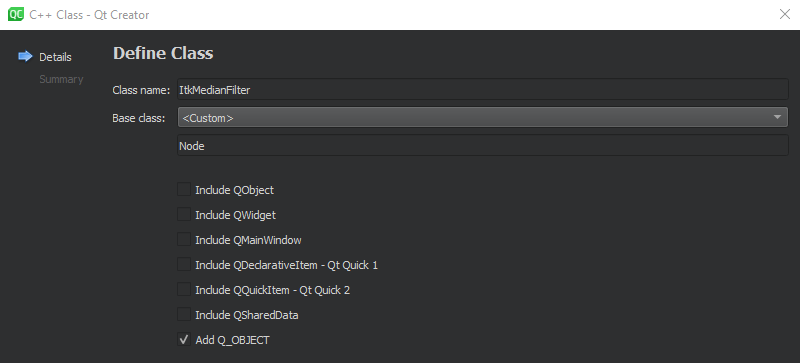
</center>

- Click *next*, then *finish*
- Ignore CMake warning
- Right-click on the project root and select “Run CMake” (or in the Menu *Build/Run CMake*)

##### Implement filter class

The structure of filter classes are quite similar. So you can orient on predefined filters. 

- Open the header file of your new filter:

```c++
#ifndef ITKMEDIANFILTER_H
#define ITKMEDIANFILTER_H
#include "node.h" // (1)

class ItkMedianFilter : public Node // (2)
{
    Q_OBJECT // (3)

public:
    explicit ItkMedianFilter();
    virtual ~ItkMedianFilter() {}

    virtual bool retrieveResult(); // (4)
};
#endif // ITKMEDIANFILTER_H
```

- Pay attention to the following steps:

	(1) Include "node.h".

	(2) Inherit from the Node class.
    
	(3) Use Q_OBJECT macro with the class.

	(4) retrieveResult() is a pure virtual function of the base class. So it must be implemented and it shall contain the actual filter functionality.

- Now go to the source file of the new filter.
- Filter can have different Attributes. Most of the time a filter needs integer or double values. Implement the Constructor and add Attributes to the Attributesystem like shown below. Check out the folder *src/nodes/attributes* for more possible attributes. Please read the commented lines carefully!
```c++
ItkMedianFilter::ItkMedianFilter()
{
    // register an attribute using the member function
    // the first argument represents the attributename (used for accessing)
    // !!!***********************************************!!!
    // never start with Capital Letter or the automatic QML View
    // creation will fail
    // !!!***********************************************!!! 
    // the second argument is the pointer to the actual attribute class
    // every attribute has a Constructor where you need to specify your attribute constraints
    registerAttribute("radiusX", new NodeIntAttribute(1, 50, 0, 1    );
    registerAttribute("radiusY", new NodeIntAttribute(1, 50));
    // some Attributes also create accesible constraints for their constraint values
    // see NodeRangeAttribute, these constraints are accessed by the 
    // corresponding QML Attribute    
    // specify the NodeName (usually: Libraryname + Filtername)
    m_nodeName = "ItkMedian";    
    // you can also add more or less than 1 input Port (default is 1)
    // m_inPortCount = 42; 
	// adds 42 inputPorts to the node (not recommended)
    // if you specify the membervariable m_warningMessage, a warning will show when
    // creating the Node
    // m_warningMessage = "very dangerous node (can bite)"
}
```

- Implement retrieveResult() by following the next code listing:

```c++
bool ItkMedianFilter::retrieveResult()
{
    // if the node has no predecessor return (no input node connected)
    if (m_inNodes.size() < 1) {
        return false;
    }
    else {
        try {
            // get the result of the predecessor node
            // and save it in the own m_img member
            m_img = m_inNodes[0]->getResult();
            // return if the predecessor result is empty
            if(!m_img.isSet()){
                return false;
            }
            // concrete Filter implementation

            // get the concrete image using the function provided by GImage
           	itk::Image<unsigned char, 2>::Pointer itkImage = m_img.getItkImage();

            // Itk specific definitions
            constexpr unsigned int imageDimension = 2;
            using InputImageType = itk::Image<unsigned char, imageDimension>;
            using OutputImageType = itk::Image<unsigned char, imageDimension>;
            using FilterType = itk::MedianImageFilter<InputImageType, OutputImageType>;

            FilterType::Pointer filter = FilterType::New();
            InputImageType::SizeType indexRadius;
            // retrieve the Attribute value using the function getAttributeValue
            // .toInt() needs to be used because the Attribute is an integer
            // getAttributeValue returns a QVariant Type (see Qt documentation)
            indexRadius[0] = getAttributeValue("radiusX").toInt(); // radius along x
            indexRadius[1] = getAttributeValue("radiusY").toInt(); // radius along y
            filter->SetRadius( indexRadius );

            filter->SetInput(itkImage);
            filter->Update();
            itkImage = filter->GetOutput();
            // after the filtering is processed set the Image to m_img
            m_img.setImage(itkImage);

        } catch (int e) {
            qDebug() << "ItkMedianFilter. Exception Nr. " << e << '\n';
            return false;
        }
    }
    return true;
}
```

- The setter function for the Attributes is implemented in *node.cpp* and can be overwritten if special behaviour is needed

##### Register filter as QML Object

- In *main.cpp* include the header of the implemented filter. Also add the following code to the main function:
  
```c++
// !!! use the same string as m_nodeName as the argument to register the node !!! 
nodeProvider->registerNode<ItkMedianFilter>("ItkMedian");
```

##### Create your own Node-View

- Graph-ICS creates the Node-View (display in canvas) automatically, using the values and Attributes specified in the Constructor of the filterclass, but also gives you the freedom to implement your own View
- For Details on how to hardcode the View check out the *qml/nodes/ItkCannyEdgeDetectionFilter.qml* and *qml/nodes/VideoNode.qml* files
---