Graph-ICS
===

## Table of Contents
1. [Overview](#overview)
2. [Installation](#installation)
3. [User Guide](#user-guide)
4. [Developer Guide](#developer-guide)

## Overview

    

Graph-ICS is a **[CMake](https://cmake.org)** project for image processing, it uses   **[QML](http://doc.qt.io/qt-5/qtqml-index.html)** and **[QtQuick](http://doc.qt.io/qt-5/qtquick-index.html)** for implementing the user interface.
The **[ITK](https://itk.org/)** and **[OpenCV](https://opencv.org/)** Libraries and filters are used as well. 

Graph-ICS uses nodes to represent filters and images. Each node has an input and an output, which are images. 
Double clicking on a node will shows you the output of this node on the right window site.
By creating edges between the nodes you can create a workflow between the nodes. 

You can also concatenate nodes connecting the output of a filter node with the input of another one.

	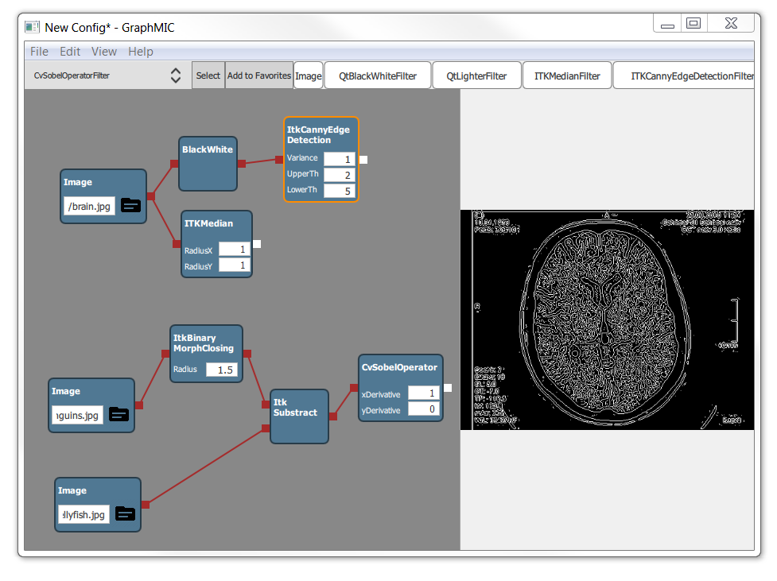

The programm is devided in two parts: the canvas (drawing area) and the viewer. Inside the canvas the user is able to create nodes and connect them. if he double-cklicks on one node the output will be shown in the viewer on the right side.

Example: 

	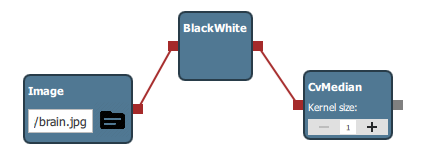

The user creates the node "Image" and selects a image file from his file system by clicking on the file symbol. To add the Black-White-Filter he creates the related node and connects the two nodes by drawing an edge between them. The output of the Black-White node is now the editet picture. This can be repaeted as often as required. the output of the last filer (CVMedian) is the image which was loaded from the user with two filter operations. 

## Installation

Installing Graph-ICS with QT, ITK and OpenCv

Required components

- Windows 7 Operating system
- Visual Studio 2017 or Visual Studio 2015 compiler.
- CMake GUI
- Qt 5.1 1 .0 with Qt Creator
- ITK
- OpenCv 3.4.

With a successfully execution of the Installations guide steps, you should be able to
build and run the project.

#### Please read the instructions carefully and pay attention to the

#### complementary images.

## Contents

1. Installing Debugging Tools from the Windows SDK 
2. Installing Visual Studio 
3. Preparing CMake 
4. Installing Qt 
5. Installing and Build ITK 
6. Installing and Build OpenCV 
7. Download and configure the project (Graph-ICS)

### 1. Installing Debugging Tools from the Windows SDK

Windows SDK contains a CDB Debugger, you will need it in case you want to debug
the application on Qt.

1.1. Go to the official Microsoft site https://www.microsoft.com/en-us/download/details.aspx?id=

1.2. Click on Download, to download the installer.

1.3. Run the installer.

1.4. Read the licence and select I Agree

1.5. Click next.

1.6. Select the Options like on the image, click next.

	

1.7. If the Installer Fails, you must close the installer, uninstall all versions of the
Visual C++ 2010 Redistributable and try to install the Debugging Tools for
windows again.

## 2. Installing Visual Studio

Installing Visual Studio Express 2017 for Windows Desktop

2.1. Go to the Microsoft website
    https://visualstudio.microsoft.com/de/vs/express/
    
2.2. Scroll to the bottom of the site and click on “Express 2017 for Windows Desktop”, the installer will be downloaded.

	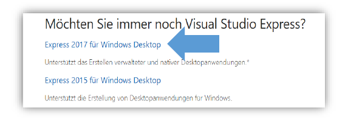

2.3. Go to the downloads folder, select the installer and run it as administrator.

2.4. You may see a pop-up “We have to prepare some things...” click on
    continue.
    
2.5. Click on install.

	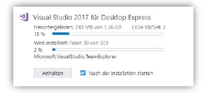

2.6. Wait until the installer is done and close it.

## 3. Preparing CMake

This step is needed if you do not have a pre-installed CMake version on your system.

3.1. You can download a windows installer of CMake (cmake-3.12.1-win64-x64.msi)
from the CMake download page. Follow the instructions provided on the CMake
installation page for downloading and installing the software

	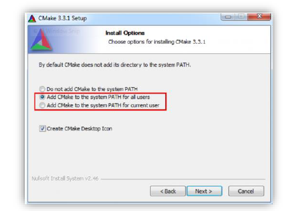

Note: Add CMake to the system path.

## 4. Installing Qt

If you already have a Qt version on your system, just open the Qt Maintenance
Tool, click on next, skip, select add or remove components and continue, so
continue with step 4.

4.1. Go to the download site https://www.qt.io/download, go to open source,
select go open source and then download.

4.2. Run the installer, click on next, skip, if the installer throw an error like
“Failed to connect to server”, so click on Options and select “no Proxy”

4.3. Select the path where you want to install Qt, recommended on “D: \lib\Qt ”,
click continue.

4.4. Select the components you want to install, the ones you need are:

- Under Qt 5.11.0: MSVC 2015 64-Bit or MSVC 2017 64-Bit
- Under Tools: Qt Creator 4.7.0 CBD Debugger Support 4.5.
- You can add or delete Tools every time using the Qt Maintenance Tool.

4.5. Finish the installation and not open QtCreator

4.6. Add the D:\lib\Qt\Tools\QtCreator\bin path to the environments variables

4.7. Setting the QT Creator up (NMake Generator)

- Open the QtCreator, go to Tools and click Options

	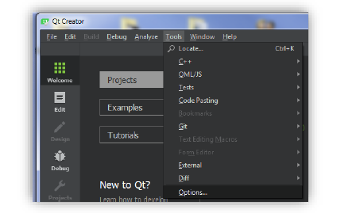

- On the left pane, go to Build & Run
- On the right you will see different tabs, go to “Kits” ,
- Select the MSVC precompiled tool, you have installed on step 4.4 and
    want to use an on the right site click on clone
    

	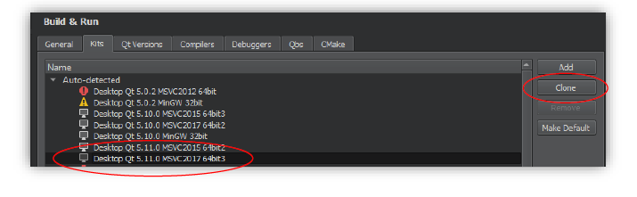

- You will see the cloned kit will appears on the bottom side of the window,
    select it and go to “CMake generator” and click on change:
    

	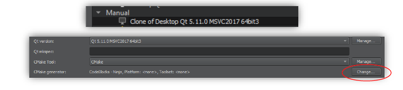

- Select NMake MakeFiles JOM as generator, and CodeBlocks as
    Extra generator.
    

	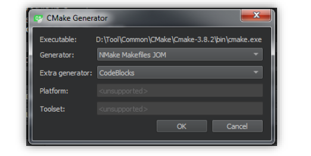

- Click on Apply and ok.
- If you want to debug, make sure you select the correct path to the
    debugger like on the follow snip.
    

	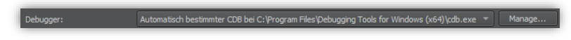

- Close QtCreator.
- Add the following path to the env variables
    D:\lib\Qt\5.11.0\msvc2017_64\bin

## 5. Installing and Build ITK

5.1. Create a folder “ ITK ” with a subfolder “ bin ” (recommended on D:\lib\)  
5.2. Go to https://github.com/InsightSoftwareConsortium/ITK

- On the left site on Branch select “release” and on the right, click on clone or download, then click download zip
- Move the Zip file to the ITK folder
- Right-click the Zip file and select unzip it here, so it will be a folder “ITK-release” created, this will be the source folder.
    
5.3. Open the CMake GUI

- On “Where is the source code” set the path to the unzipped “ITK-release” folder
- On “Where to build the binaries” set the path to the bin folder you created before

	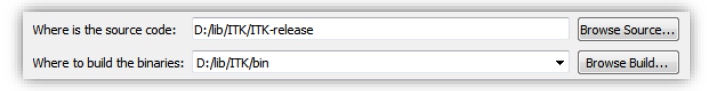

- Click on Generate so on the pop-up window select “Visual Studio 15 2017 Win64” (see the image below, if you have Visual Studio 2015, 	     then select Visual studio 14 2015 Win64) as generator and click finish, it will take a couple of minutes to configure the project.

	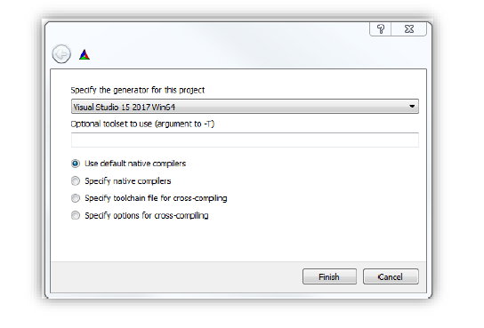

- The output window will tell you the configuring is done, so search for  the component BUILD_TESTING and uncheck it! then click on
    configure:
- The output window will tell you the configuring is done, so search for
    the component KWSTYLE and uncheck it! then click on configure

	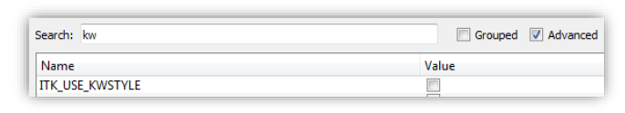

- When the configuration is done, then click on generate, so it will generate a Visual studio project.

5.4. When it finishes the generation, so you can click on “Open Project” and it will
be open with Visual studio.

5.5. On Visual Studio

- Wait until the project initializes and parses the files. (you can read it on the blue bar on the bottom)

	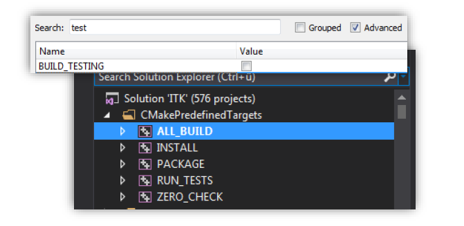

- You see on the solution explorer several project files, go to the
    “CMakePredefinedTargets” folder, so right-click on ALL_BUILD and
    select “build” , it will take several minutes to complete the process.
- Make sure you make this step for both Debug and Release configuration,
    so Visual studio will generate the appropriated libraries for each of them.
- Right-click on INSTALL and select “build”, make sure you make this
    step for both Debug and Release configuration. (This step is needed for
    the CMake to find the properly paths to ITK)
- If Visual Studio fails to compile the Installation subproject, consider
    trying it again running visual studio as administrator.

## 6. Installing and Build OpenCV:
This Step performs the OpenCv build and install, you can download and use
the pre-compiled binaries from OpenCv online following the step 6.
(Recommended) or you can build the binaries from yourself on step 6.
using the same procedure like with ITK on step 5 but it will take a long time.

	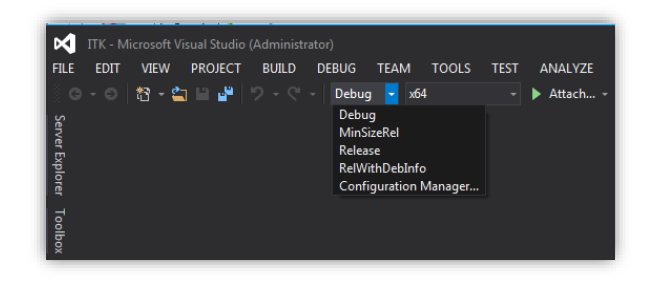

6.1. USING THE MSVC BINARIES: On the Website from OpenCv
(https://opencv.org/releases.html) you can find the already build
binaries package for Windows or IOS:

- Select Win pack from the latest version, the download will take up to 2
    Hours for each configuration.
    

	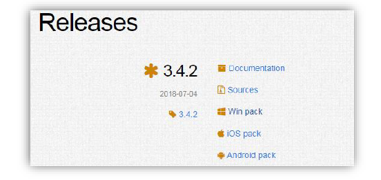

- Go to the download folder and click on the opencv....exe you
    downloaded.
- Set the path where you want to extract the package (D:\lib\).
- Extract the files.
- A opencv folder will be created on D:\lib\
- Make sure you add the build path to the environment variables
    (D:\lib\opencv\build).
    
6.2. BUILDING OF OpenCv BINARIES with MSVC:
Follow the same Steps like on 5 with following changes:

- For 5.1 create a Folder OpenCv with a subfolder “bin” (recommended
    on D:\lib\).
- For 5.2 Download the OpenCv from https://opencv.org/releases.html,
    select sources.
- Move the Zip file to the OpenCv folder
- Right-click the Zip file and select unzip it here, so it will be a “opencv-3.4.2”
    folder created, this will be the source folder, rename it to “opencv”.
- For 5.3 omit to uncheck the KWSTYLE component on the CMake
    Configuration from OpenCv.
- Configure and generate with Cmake and continue making the same
    procedure as step 5.

## 7. Download and configure the project (Graph-ICS):

7.1. Clone the project from the following repository:
https://github.com/Graph-ICS/Graph-ICS to you folder
(D:\Graph-ICS)

7.2. Open the Qt Creator and click open project on the Welcome tab.

7.3. Go to the path of the project (D:\Graph-ICS) and select the CMakeLists.txt
file

7.4. Qt Creator will show you the possible configurations you can use for your
project, Select the kit you cloned on step 4.7 installing Qt. then click on
details select Default, Debug and Release
and click on “configure project”

	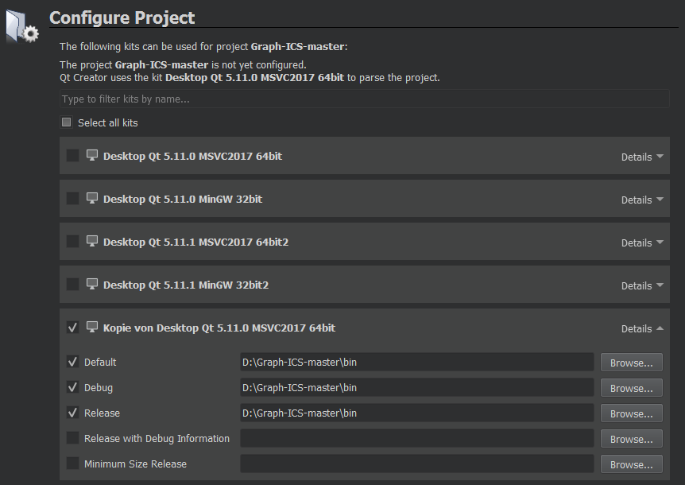

7.5. Make sure as build folder on Qt Creator is set the bin folder of the project, if
not, then change to it or create it like on the following image and go to the
tab edit right-click on the project folder and run CMake.

7.6. (Optional)If you have another configuration and it fails, so make sure you
delete the created CMakeCache.txt on the GraphMic0.7\bin folder and the
CMakeLists.txt.user on the source folder before you try it again.

	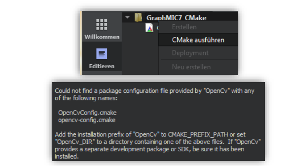

7.7. (This step can be optional if you add the opencv build directory to the
environment path variables) If the CMake don’t find the ITK or OpenCv
libraries automatically, then you will see the error on the common output tab
below like on the following image, so you must set the paths manually using
the CMake GUI:

- Open CMake Gui, set the GraphMIC source folder and the binary folder, click on file and reload cache

	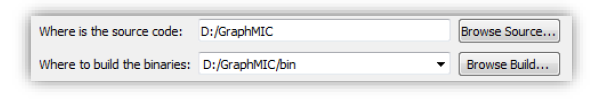

- CMake GUI and set the correct build path of the OpenCv directory on the  field OpenCv_Dir and click on configure

	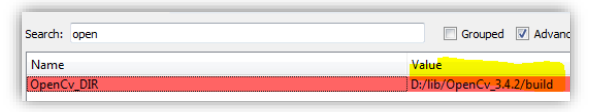

- (Repeat the proces for ITK_Dir) Go back to Set the correct build path
    of the ITK directory on the field ITK_Dir and click on configure, click on reload cache.

- Go to Qt Creator, Edit tab and click on Run Cmake.
- (Optional)CMake might will throw an error, but the path should be already
    set, so you can ignore it.
    

	

- Close CMake GUI

7.8. Go to Qt Creator to the tab edit right-click on the project folder and run
CMake, the project should be configured jet and you will see all the folders
and files corresponding to the project on the left tab:

	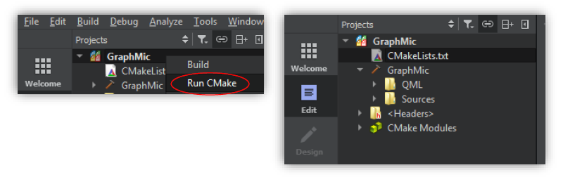

7.9. You should be able to build and run the project, maybe you should restart the
Qt Creator und re-open it and the project from the recent used projects pane.

	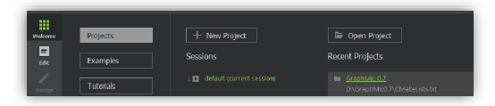

7.10. If you want to debug the application in C++ and QML go to Projects,
and on the Run option, click on enable QML.

	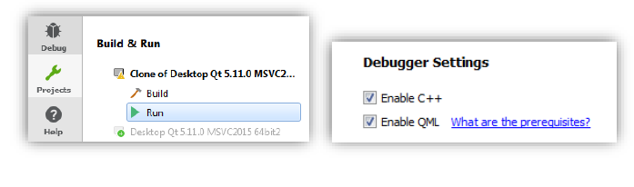

## User Guide
- **Loading an image**   
In order to load an image you must create the node "Image". To do so, go to the combobox and select the item "Image" in the list view (1). by clicking the "Select" Button the node will be created (2).
You can either write the path to the image you want to edit in the text field or select it drom you file explorer by clicking the file symbol (3)

	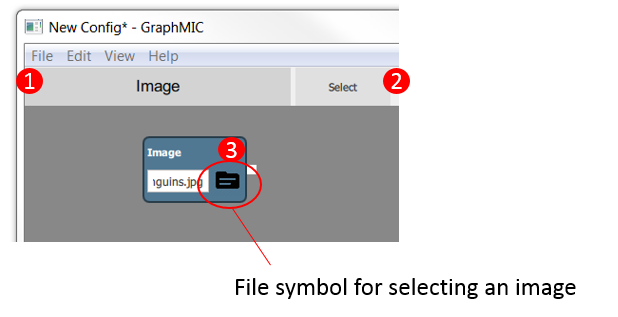

- **Adding a filter**  
If you have created an image you can execute a filter on it by creating a node according to the filter you want. Then connect the image with the filter by drawing an edge from the output from the image to the input of the filer. Double-click on the filer and the edited image will be shown in the viewer. This can also be done if you click right on the node and select "Show Image" in the context menu.

	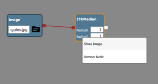

- **Removing an node**  
Right-cklicking on a node will open a context menu. Click "Remove Node".

	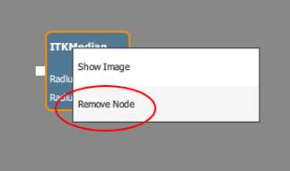

- **Edit nodes**  
If you want to edit various nodes you can select them by drawing a rectangle on the canvas with your mouse (1).

	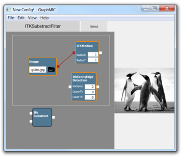

The selected nodes will be marked and you can perform differnet actions on them with the menu "Edit" (2)

	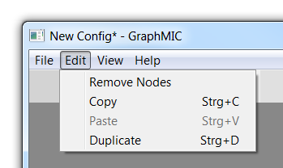

- Deleting all marked nodes: "Edit" -> "Remove Nodes"
- Copy all marked nodes: "Edit" -> "Copy" 
- Past the copied nodes: "Edit" -> "Paste" (you can also paste the selected nodes from one file to another)
- Duplicate: "Edit" -> "Duplicate" (Copy and Paste in one step) 
- Move all marked nodes: drag one of the selected nodes and move it with the mouse, the other nodes will also chage their position
- **Manage your Configuration**  
You can save your current confguration and open existing configurations at the menuitem "File". It is also possible to select an image from your filesystem which will be shown in the viewer.

	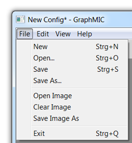

These options are also available by clicking right on the canvas or viewer.
At the canvas:

	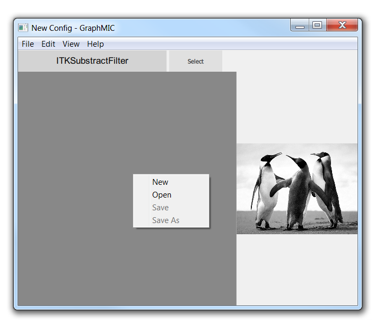

At the viewer:

	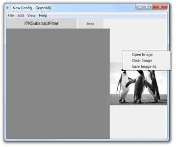

- **Favorites Toolbar**  
The programm allows to add filters to the toolbar. To do so, go to the combobox and right click on a filter. Select "Add To Favorites".

	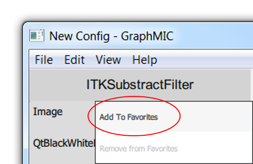

The filterbutton is now available in the toolbar. Pressing on the filterbutton and moving the mouse inside the canvas will create the node at the requested position.

	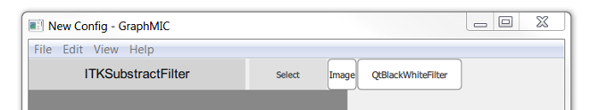

The items in the toolbar can be rearranged by right cklicking and selecting "Move Item". Now you can drag the item with the mouse inside the toolbar.
You can delete the item from the toolbar with the context menu in the combobox or in the item itself

	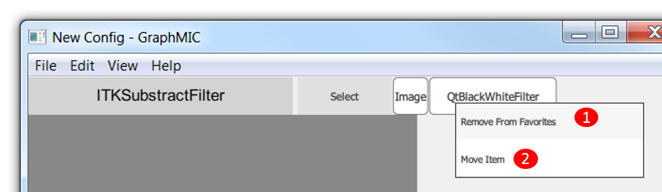

## The diffenrent components of the programm are explained by the following figure:

	

 1.	**Menu tab: There are different Menu Items:**

	1.1. **File:** you can manage your current file  
	

	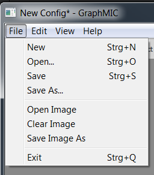
	

	

	- open a new configuration
  	- open a configuration from your file explorer
	- save your current configuration
	- save your current configuration and select the name and path
	- open an image in the viewer from your files
	- remove the image shown in the viewer
	- save the current image in your viewer
	- exit the programm

	1.2. **Edit:** you can remove selected Nodes, Copy, Paste and Duplicate them
	
	1.3. **View:** if only one node is selected you can either get the result or delete this node
	
	1.4. **Help:** Information: About us and licences 

	
2.	**Toolbar: You will find all available filters in the combobox. You can scroll to the filter you want and then click "Select" to create a filter. If you choose "Add to Favorites" the filter will be shown in the toolbar and you can drag the node to the position you want**
	
3.	**Canvas: you can drag the nodes here and draw the edges between them**
	
4.	**Viewer: If you double click on a node, you will see its result image (output) here**
	
5.	**Image node: This node is an image node, you can load images on it, writing the path of the image on the textbox, right click on it to show or delete.**	
	
6.	**Filter node: The filter node allows you to set parameters to the filter, you need to connect it to an image node to apply on it the filter, right click on it to show or delete.**	

7.	**Edge: To create an edge, you just must click on a node port, hold and drag with the mouse to the position you want to connect with.**	
## Developer Guide

Contents
1. About the structure  
1.1. QtQuick and QML  
1.2. C++ Model  
2. Creating a new filter node  
2.1. Choose the filter  
2.2. Adding a new C++ filter class  
2.3. Implementing the filter class  
2.4. Defining the filter class in the source file  
2.5. Register the class as QtQuick QML Object  
2.6. Create your QML file  
2.7. Update the toolbar buttons  

### 1. About the structure

The structure of Graph-ICS is divided on two components

#### 1.1. QtQuick and QML
The QtQuick framework includes the QML declarative scripting language, QML
Objects are useful for the interaction with the user, the GraphMic user interface is
conceded on QML, in GraphMIC it makes possible to:

- Represent filters and images using nodes the user can drag on the Editor
pane (using customs objects)  
- Create a data flow between the created nodes connecting them using edges.
Interact to mouse and key events like user inputs.  
- Allow the user to change the filter values on a filter node and apply the filter
with these new values by clicking on it.  
#### 1.2. C++ Model

Each filter node represents a C++ Class defined as **\<ClassName\>Filter** , each filter
class is registered as QML Object on the main function so it can be instantiated as
QML Object. For more information go [here](http://doc.qt.io/qt-5/qtqml-cppintegration-exposecppattributes.html)

A typical filter class declaration will be showed on the Figure 1 : Typical filter
declaration, here the ItkDiscreteGaussianFilter.

- The **Q_OBJECT** macro tells the compiler this class implements its owns
signals and slots, so the meta object compiler moc need to run at first  
- The **Q_PROPERTY** macro will be used to tell the compiler the variables to be
read through a given get method, write through a given set method and the
changes will be notified using the given method next the NOTIFY macro  
- The **Q_INVOKABLE** macro allows functions to be called from QML objects  

	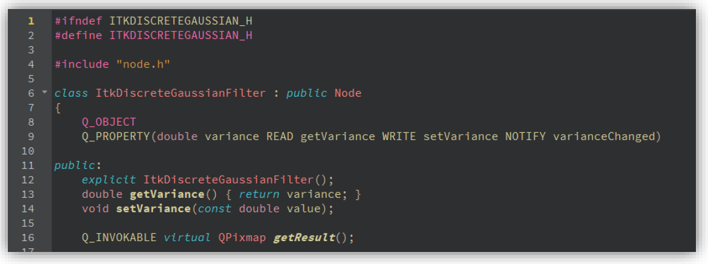

*Figure 1 : Typical filter declaration, here the ItkDiscreteGaussianFilter class*
### 2. Creating a new filter node
To create a new filter object, it is needed to create a new filter class, register this
class as a QML object and add it into the window toolbar to make it visible for the
user. As example we want to add the *ITKMedianImageFilter* as follows:

#### 2.1. Choose the filter
- Go to the documentation page of the filter you want to implement, for OpenCv or
ITK (Another good website for ITK examples is <https://itk.org/Wiki/Main_Page> or
<https://itk.org/ItkSoftwareGuide.pdf>
- Read the documentation of the filter and check the input parameter you will
need.
- For our example filer the documentation can be visited at:
<https://itk.org/Doxygen/html/classitk_1_1MedianImageFilter.html>
#### 2.2. Adding a new C++ filter class
Open the project, if you open the project for first time, so follow the step 7 from the
installation guide. Open the QtCreator and select by the Welcome Tab, the
Graph-ICS project.

	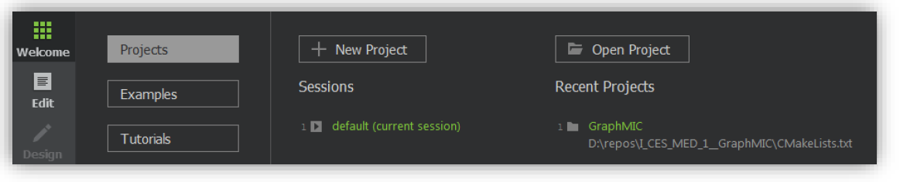

- Go to the Source folder
- Go to the Filter folder
- Right click on the filter folder and click on **Add New...**

	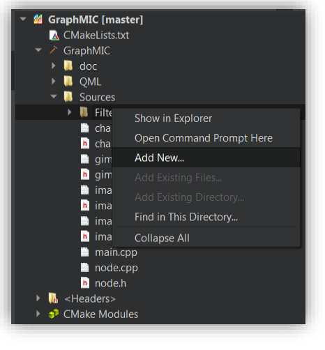

- Select C++ Class, click on choose.
- Name the class like the filter you want to implement. (for example,
ItkMedianFilter), look at the existing classes and the names on camel case
- Click on finish.
- If you get a warning from Qt, ignore it
- Run CMake right clicking on the project folder and selecting “Run CMake”.

	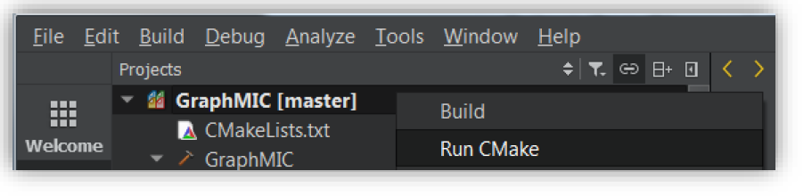

- Now a both header und source files from your class are available on the
project pane.
#### 2.3. Implementing the filter class
- Go to the header file of your new class

- The filter classes are very similar only the filter parameters might change, so you can
define your class using the definition of an existing filter class

- For our example the median filter needs two parameters: m_radiusX and
m_radiusY, so we create these two variables on our class ItkMedianFilter, add its
get, set methods and Q_PROPERTIES.

	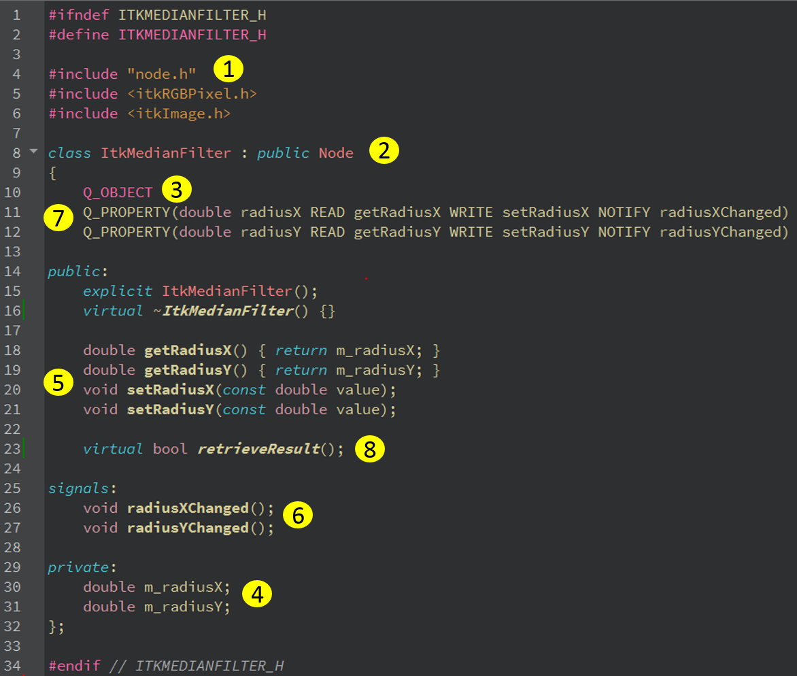

 *Figure 2 : ItkMedianFilter Class, implementation example*  

Consider the *Figure 2 : ItkMedianFilter Class, implementation example*. by
implementing your filter class, pay attention to the following steps:

1. The class should include the node.h header.
2. The class should inherit from the Node class as public.
3. The class should include the Q_OBJECT macro.
4. In case the filter you want to implement needs some input values, so you need
to create this input values as member variable.
5. Implement for each parameter variable the get and set methods.
6. Add a Notify Signal for each member variable you will use as parameter.
7. Add the Q_PROPERTIES for each member variable on the class, using its
get, set methods and signals. This will be needed to exchange data between
the model and the view on the QML site.
8. Implement the retrieveResult() function.

#### 2.4. Defining the filter class in the source file
- Go to the source file of your class.
- Define your constructor giving a default value for each input parameter (Look
at the documentation).
- Define the get and sets methods, make sure you call the function
cleanCache() on the set methods.

	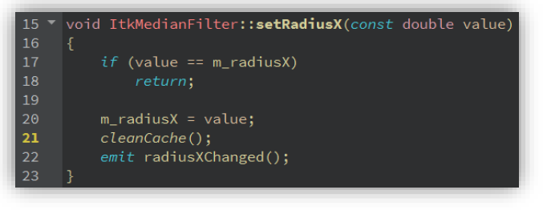

- Override the virtual function retrieveResult() as follows:  
Consider the Figure 3 : itkmedianfilter.cpp, definition of retrieveResult(), the new class
needs also to overwrite the virtual function node::retrieveResult().

	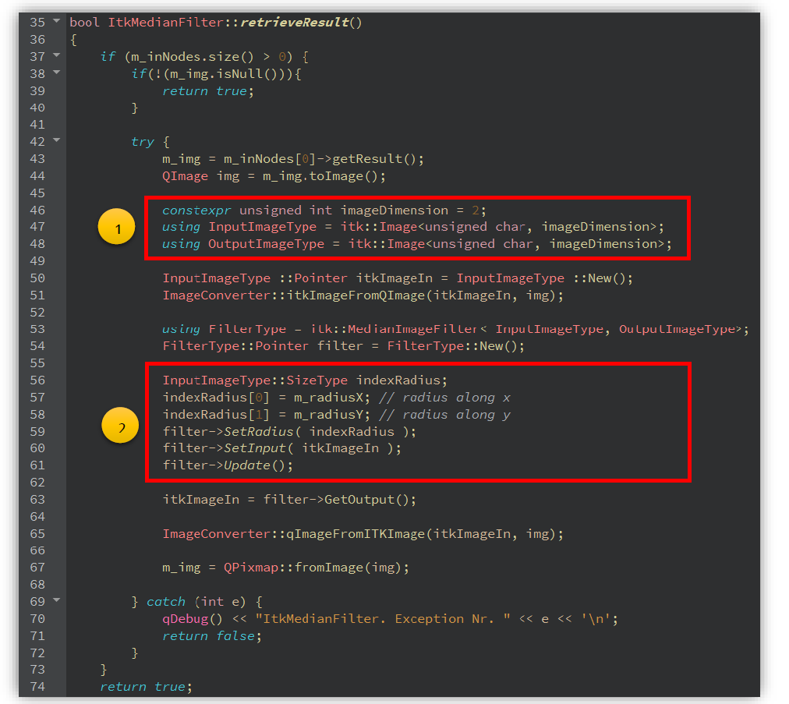

*Figure 3 : itkmedianfilter.cpp, definition of retrieveResult()*

The filter will be implemented on the Try block. The definition of the
ItkMedianFilter::retrieveResult() function follows these 6 steps:

1. The first If clause will check if there is an input, so this input is an QPixmap, we
convert it on a QImage format to access to its pixels values. (line 37)
2. The second clause will check if the m_img variable is set (this variable holds the
input image), in this case the current value will be loaded. (line 38)
3. On the Try block, we get the image input, prepare the ITK filter with the proper
parameters: InputImageType, OutputImageType and ImageDimension. (line
43 - 50 )
4. We use the ImageConverter::itkImageFromQImage(TargetITKImage,
FromQImage) function to convert the input QImage to a ITK Image. (line 51 )
5. We create the ITK::MedianImageFilter pointer using the given InputImageType
and OutputImageType parameters from step 3 (line 53 - 54), and set the values
given from the user. (line 56 - 61)
6. The ITK Image output from filter will be converted to an QImage to
continue the data flow. (line 63)
7. In order to continue the flow between the nodes, we need to convert out filter
output to an QImage, so we call the
ImageConverter::qImageFromITKImage(TargetQImage, FromITKImage)
function. (line 65)
8. In case an exeption occurred, then it will be catched on the catch block. (line 69-72)
9. If the Filter was correct implemented, so the function retrieveResult() returns the
flag true.(line 74)  

Take care of the valid parameter types and values for your filter, the Figure 3 :
itkmedianfilter.cpp, definition of retrieveResult() shows the position where this
parameters might change for each ITK filter. The number 1 represent the input pixel
types and image dimension, the number 2 represents the ITK filter parameters.

#### 2.5. Register the class as QtQuick QML Object
Once we have already prepared the class following successfully the step 2 , so we
should register this class on the main.cpp file as QML Type, it will make possible to
use this class on QML files declaring it as normal QML Object.

So, we will need to add the following line to the code (take care of the used name
convetion):

	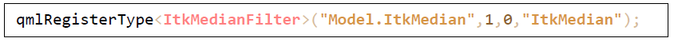

The syntax for this function should be as follows:

	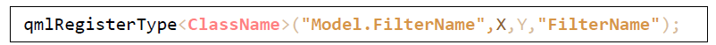

Whit X, Y as the package version. We will always use the package version X= 1 and
Y = 0. Make sure you include your class header file, so we must add the line:

	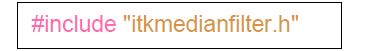

#### 2.6. Create your QML file
In this step you should create a QML file on the QML project folder to be able to use
our filter class in our user interface.

- Right click on the QML/file folder, select Add new
- Select Qt, and QML File as the following image

	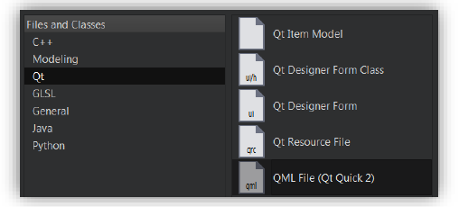

We turn into the QML coding, so we create a new file to hold the created class on the
QML folder, we name this file ITKMedian.qml, like the name of the filter you want to
create.

	

*Figure 4 : Importing the needed components*

We add the showed import packages like on Figure 4 : Importing the needed
components to the top of the QML file.

qmlRegisterType< ItkMedianFilter >(" Model.ItkMedian ", 1 , 0 ," ItkMedian ");

qmlRegisterType< ClassName >(" Model.FilterName ",X,Y," FilterName ");

#include "itkmedianfilter.h"

For your class you need to change the line 6 , and import the filter name you
registered before on the step 2.5, the numbers following the import package are
taken as the package version.

If the Filter needs 2 inputs, you must instantiate an QML Object from the class
GFilter2Ports.qml as parent, so just write GFilter2Ports on line 8.

If the Filter needs 3 inputs you must instantiate the parent GFilter 3 Ports.qml, so
write GFilter 3 Ports.

If your filter just need one input, so use the GFilter object as you see on the Figure 5 :
Filter object on QML..

For the median filter we just need one input, this will contain all the needed
implementations for a basic node (dragging, connections through edges...), so we
use the GFilter object.

Inside this GFilter Object, you need to create an instance of your filter class (lines
14 - 16 ) with the id: model and a property alias to the model (line 1 8 ) like on the
Figure 5 : Filter object on QML.

	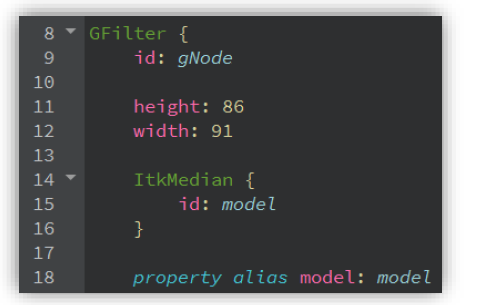

*Figure 5 : Filter object on QML.*

Create a Label to hold the filter name, for us “ITKMedian”.

Create a Label and a TextField for each input parameter your filter needs, the Label
just holds the parameter name and the TextField will contain the parameter value,
make sure you give each TextField a valid id.

For us, the ItkMedian needs two inputs: RadiusX and RadiusY, so we created the
corresponding labels and textfields.

	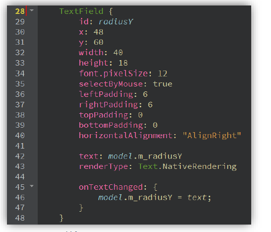

*Figure 6 : TextField for an input parameter*

Consider the Figure 6 : TextField for an input parameter, for each input parameter,
you should create a TextField like this for each input parameter, it is recommended
to use the parameter name as id (line 29), its text property should hold the
parameter value from your filter class model (line 42), the onTextChanged event
should be implemented changing the model parameter every time the TextField text
changes (Lines 45- 47 ).

	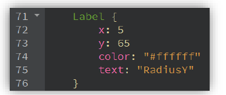

*Figure 7 : Parameter name “RadiusY”, represented with a Label*

The parameter name for the TextField radius, will be showed using a Label, see
Figure 7 : Parameter name “RadiusY”, represented with a Label.

	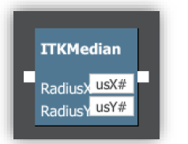

*Figure 8 : Designer view of the ITKMedianFilter.qml*

If you click on the left pane, on the Design tab you can see the result of your code,
like on the Figure 8 : Designer view of the ITKMedianFilter.qml.
The design does not look ecaxtly like this in the programm but you can see the size of the node and the position of the labels. 

The last step consist on implementing two functions saveNode() and loadNode() its
implementation are same for each filter, but the ids might vary. If the filter you want
to implement have no input parameters, you don’t need to implement these
functions.

	

*Figure 9 : ITKMedianFilter.qml, functions saveNode() and loadNode()*

Consider the Figure 9 : ITKMedianFilter.qml, functions saveNode() and loadNode(),
the lines 84- 87 und 90 are same for each filter node, the next lines 88-89 will vary
depending on the input parameters and the TextField id’s.

On the function loadNode(), we will read the values from the saved nodeData JSON
object and load it into the TextFields representing the saved configuration values.

2.7. Update the toolbar buttons
On the GToolBar.qml go to the ListModel and add your filter as a new ListElement
object, see Figure 10 : ListModel and ListElements.

The name of the new ListElement should be exactly the name of the QML file you
created without the .qml ending.

	

*Figure 10 : ListModel and ListElements*
