Graph-ICS
===

## Table of Contents
1. [Overview](#overview)
2. [Installation for Windows](#installation-for-windows)
3. [Installation for Linux](#installation-for-linux)
4. [User Guide](#user-guide)
5. [Developer Guide](#developer-guide)

## Overview

    

Graph-ICS is a software for image processing. It supports image filters using **[ITK](https://itk.org/)** and **[OpenCV](https://opencv.org/)**. Its user interface is based on  **[QML](http://doc.qt.io/qt-5/qtqml-index.html)** and **[QtQuick](http://doc.qt.io/qt-5/qtquick-index.html)**.

The user interface is divided into four parts: the Sidepanel on the left, the Canvas (drawing area) in the middle, the viewer on the right and the Statusbar under the Canvas. The User can place Nodes on the Canvas via drag&drop from the Sidepanel (holds all registered Nodes) or from the Favoritesbar at the top. Favorites can be added via drag&drop from the Sidepanel by pressing and holding an Element. Nodes represent input (Image, Video or Camera) and filters.

Nodes can be connected to each other. So they can have input nodes on their left side and output nodes on their right side. Usually there is one input for a chain of filters.

The picture below shows an example:

<center>
	
</center>

Via double-click on a node the corresponding output will be calculated and shown on the right side by the viewer.

The Example above illustrates the moments after the ItkCannyEdgeDetection-Node was double-clicked and processed. The Concept of Graph-ICS is to always process Nodes in a recursive Order. The clicked Node asks the predecessor if it has a processed Image, if not the predecessor asks its predecessor for an Image and so on. If nothing is has been calculated, the Image-Node gets calculated first, then the result-image gets processed by CvMedian-Node, at last ItkCannyEdgeDetection-Node processes the result of CvMedian-Node and shows the resulting Image in the Viewer.
Having a closer look at the Nodes, a missing '*' at the end of the node-name indicates, that this Node has already been processed and the result is available in the cache.
The node-color shows the user, that the image in the Viewer represents the result of ItkCannyEdgeDetection-Node.

## Installation for Windows

After following the steps provided by the Installation Guide you should be able to build and run Graph-ICS.

Required components for Windows:

- Microsoft Windows 10
- Visual Studio 2015 || 2017 || 2019
- CMake
- Qt 5.15.1 or later with Qt Creator
- ITK newest Version
- OpenCV 3.x

**Please read the instructions carefully and pay attention to the complementary images.**

### Contents

1. Download Project from GitHub
2. Install Visual Studio 
3. Install Debugging Tools from the Windows SDK
4. Install CMake 
5. Install Qt 
6. Install and Build ITK 
7. Install and Build OpenCV   
8. Configure the Project (Graph-ICS)


### 1. Download the Project from GitHub

Download from commandline (recommended):   
1.1. Install git from https://git-scm.com/downloads  

1.2. Create a folder where you want to clone the project   

1.3. Enter this folder and right-click

1.4. Click on "Git Bash Here" and the commandline will open   

1.5. Enter the command:
```sh
git clone https://github.com/Graph-ICS/Graph-ICS.git
```

Alternative way:    
1.1. Go to https://github.com/Graph-ICS/Graph-ICS in your browser  

1.2. Click on "Clone or Download"  

1.3. Click on "Download ZIP"  

1.4. Unpack the file and save it at the project path of your choice, e.g. "D:\Graph-ICS"

### 2. Install Visual Studio

To Build Graph-ICS you can use the free VS Community as well as the Professional Version.
Follow the next steps to acquire the Community Version.

2.1. Download the installer here https://visualstudio.microsoft.com/vs/community/

2.2. After running the executable wait for the download and make sure to select "Desktop development using C++". You can download the Windows SDK here to skip 3.

<center>
	
</center>

2.3. Restart your computer as requested after the installation.

### 3. Install Debugging Tools from the Windows SDK

Windows SDK contains a CDB Debugger. You will need it in case you want to debug the application. 

2.1. You can download the latest Windows SDK here https://developer.microsoft.com/en-us/windows/downloads/windows-10-sdk/

2.2. When installing select the option "Debugging Tools for Windows"

### 4. Install CMake

4.1. Download CMake from the official Website https://cmake.org/download/

4.2. Select installer of latest release

4.3. Start the installer and follow its instructions.

4.4. Select "Add CMake to the system PATH for all users" when "Install Options" is shown:

<center>
	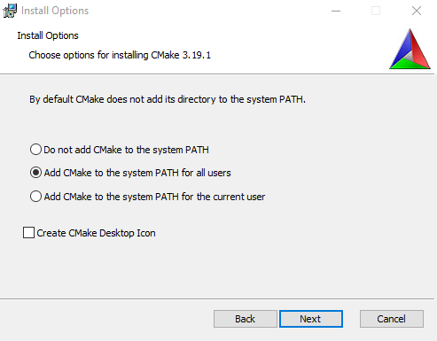
</center>  

4.5. Finish setup.


### 5. Install Qt

5.1. Go to https://www.qt.io/download, select "Go open source" and then click "Download"

5.2. Select the path where you want to install Qt, e.g. "C:\Qt". Click next.

5.3. Select the components you want to install, the ones you need are:

- Below "Qt 5.15.1": MSVC 201X 64-bit (the Compiler Version you have installed)

<center>
	
</center>

- Below "Developer and Designer Tools": "Qt Creator CDB Debugger Support"

<center>
	
</center>

5.4. Finish the installation.

5.5. Setting up the Qt Creator (NMake Generator)

- Open QtCreator, go to "Tools" and click "Options":

- Select "Kits".

- Select your prefered kit from the Auto-detected ones and press Clone (optionally rename the cloned kit)
<center>
	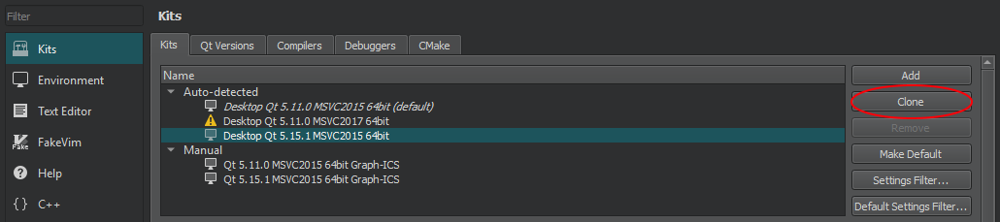
</center>

- Select the cloned kit, go to "CMake generator" and click "Change...":

<center>
	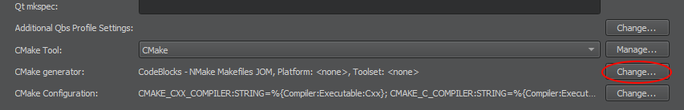
</center>

- Select "NMake MakeFiles JOM" as generator, and "CodeBlocks" as extra generator, then click "OK":

<center>
	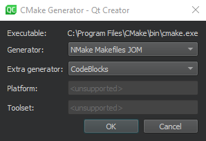
</center>

- If you want to debug make sure you select the correct path to the debugger like on the following picture:

<center>
	
</center>

- Click "OK" and close the Qt Creator.

5.7. (optional) Add the Qt Library, e.g. "C:\Qt\5.15.1\msvc2015_64\bin", to your system path


### 6. Install and Build ITK

6.1. Go to https://github.com/InsightSoftwareConsortium/ITK

- Select the branch “release”. 
- Click on "Clone or download", 
- Click on "Download ZIP"
    
6.2. Create a target folder for ITK (e.g. C:\lib\itk) 

**Note:** Do not choose a path wich is too long because CMake paths are restricted to 50 characters by default.

- Unzip the downloaded file in your ITK folder, so a subfolder will be created

- In your ITK folder create a subfolder e.g. "bin" or "build"

6.3. Open CMake GUI

- In “Where is the source code” set the path to the “ITK-release” folder.

- In “Where to build the binaries” set the path to the "bin" folder

<center>
	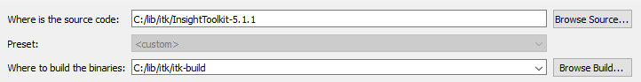
</center>

- Click on "Configure"

- A window will pop up. Specify the generator with “Visual Studio 15 2017” and make explicitly sure that you build 64bit (x64, Win64) binaries

- Click "Finish"

<center>
	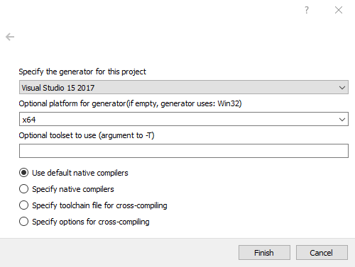
</center>

(You can ignore the error about "KWStyle")
- Uncheck "BUILD_TESTING", to speed up the build process

- Click "Configure" until there are no more red lines

- Click "Generate"

6.5. Open the, in your "bin" folder, generated project (ITK.sln) with Visual Studio

6.6. In Visual Studio

- Wait until the project is initialized. (See blue progress bar below)

- Right-click on "CMakePredefinedTargets/ALL_BUILD" and select "build". It will take several minutes to complete the process.

- Make sure you make this step for both "Debug" and "Release" configuration.


### 7. Install and Build OpenCV:

To install and build OpenCV you can download and use the pre-compiled binaries and follow 7.1 (recommended) or you can build the binaries by yourself following 7.2 (which takes much more time).

7.1. Using the prebuild MSVC binaries:

- Go to https://opencv.org/releases.html

- Select "Windows" of the **latest 3.x.x** version:

<center>
	
</center>

- Open the download folder and start the just downloaded "opencv....exe".

- Set the path where you want to extract the package. We recommend "C:\lib".

- Extract the files.
    
7.2. Building OpenCV from Source:  
Follow the steps in section 6 and consider the following changes:

- For 6.1 download OpenCV from https://opencv.org/releases.html, select "Sources" of the latest 3.x.x version.

- For 6.2 we recommend the target folder "C:\lib\opencv". Unzip the downloaded file in that folder. The created subfolder is the source folder in 6.3.
    
### 8. Configure the Project (Graph-ICS)

8.1. Open Qt Creator and click "open project" on the "Welcome" tab

8.2. Find "CMakeLists.txt" in the Source code of the project

8.3. Of the shown project configurations select the kit you cloned in step 5.6 and click "Details". Then select "Default", "Debug" and "Release" and set a binary folder (output folder), e.g. "C:\Graph-ICS\build"

<center>
	
</center>

8.5. Click “configure project”

8.6. You will see errors regarding Itk and Opencv

8.7. Open CMake-Gui and specify the Source and Build Path to your Graph-ICS Project Path

8.8. Find the Cache entry (red lines) "ITK_DIR" and enter the Path to your ITK Build Directory

8.9. Click Add Entry at the Top and a small Window will appear

8.10. Configure the Cache Variable like shown in the image below (set the Path to your OpenCV Binaries into "Value")

<center>
	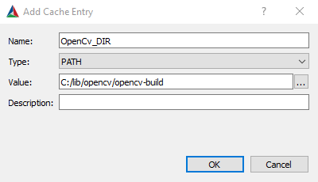
</center>

8.11. Click configure until no new entries appear

8.12. Go back to QtCreator and select "Build/Run CMake" in the Menu

### 9. Develop Graph-ICS
Feel free to publish your changes on Graph-ICS to Github. Every contribution helps!


## Installation for Linux

After following the steps provided by the Installation Guide you should be able to build and run Graph-ICS.

Required components for Linux:

- Ubuntu 18.04
- GCC Compiler
- CMake
- Qt 5.15.1 or later with Qt Creator
- ITK newest Version
- OpenCV 3.x

**Please read the instructions carefully and pay attention to the complementary images.**

### Contents

1. Download Project from GitHub
2. Install CMake 
3. Install Qt 
4. Install and Build ITK 
5. Install and Build OpenCV   
6. Configure the Project (Graph-ICS)


### 1. Download the Project from GitHub

Download from commandline (recommended):   
1.1. Install git with the command: ``` sudo apt-get install git ``` 

1.2. Create a folder where you want to clone the project   

1.3. Enter this folder and right-click

1.4. Click “Open Terminal”  

1.5. Enter the command:
```sh
git clone https://github.com/Graph-ICS/Graph-ICS.git
```

### 2. Install CMake
2.1. Install CMake with the command: ``` sudo apt-get install cmake cmake-qt-gui ```


### 3. Install Qt
3.1. Go to https://www.qt.io/download, select "Go open source" and then click "Download"

3.2 Run the file, command e.g. “./qt-unified-linux-x64-4.0.0-online.run”

3.3. Select the path where you want to install Qt

3.4. Select the components you want to install, the ones you need are:

- Below "Qt 5.15.1": select “GCC 64 bit”

3.5. Finish the installation.

3.6. Setting up the Qt Creator 

- Open QtCreator, go to "Tools" and click "Options":

- Select "Kits".

- Select your prefered kit from the Auto-detected ones and press Clone (optionally rename the cloned kit)

- Select the cloned kit, go to "CMake generator" and click "Change...":

<center>
	
</center>

- Select "Ninja" as generator, and "CodeBlocks" as extra generator, then click "OK":

- Click "OK" and close the Qt Creator.


### 6. Install and Build ITK

4.1. Go to https://itk.org/download/

- Go to the Latest Stable Release and select the file: “InsightToolkit-"version".zip 
    
4.2. Create a target folder for ITK  

**Note:** Do not choose a path wich is too long because CMake paths are restricted to 50 characters by default.

- Unzip the downloaded file in your ITK folder

- In your ITK folder create a subfolder e.g. "bin" or "build"

4.3. Open CMake GUI

- In “Where is the source code” set the path to the “ITK-release” folder.

- In “Where to build the binaries” set the path to the "bin" folder

<center>
	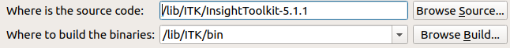
</center>

- Click on "Configure"

- A window will pop up. Specify the generator with “Unix Makefiles” 

- Click "Finish"

<center>
	
</center>

- Click "Configure" until there are no more red lines

- Click "Generate"

4.5. Go to the bin folder and open a terminal

4.6. Build ITK with the command: ```cmake --build . --target install -- -j8```


### 5. Install and Build OpenCV:

5.1. Go to https://opencv.org/releases/

5.2. Click on “GitHub” of version 3.x.x

5.3. Create a target folder for OpenCv

5.4. Go to this folder and open a terminal

5.5. Type the command,  ```git clone "link for OpenCv" ``` and press enter

5.6. Repeat the steps from 4.3.  to 4.6. for OpenCv
    
### 6. Configure the Project (Graph-ICS)

6.1. Open Qt Creator and click "open project" on the "Welcome" tab

6.2. Find "CMakeLists.txt" in the Source code of the project

6.3. Of the shown project configuration select the kit you cloned in step 3.5.3 and click “Details”. Then select “Debug” and “Release” and set a bin folder (output folder)

6.5. Click “configure project”

6.6. Open the CMake.txt file, search for OpenCv and change the lowercase v to a uppercase V
<center>
	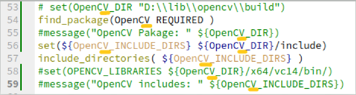
</center>

6.7. Select "Build/Run CMake" in the Menu


### 7. Develop Graph-ICS
Feel free to publish your changes on Graph-ICS to Github. Every contribution helps!

## User Guide

- ### Add an input-Node

In order to add an input-Node, drag&drop an Item in the SidePanel onto the Canvas.
Available input-nodes are Image (.png, .jpg), Video (.mp4) or Camera (Webcam).

- ### Add and apply filters

After you have created an input you can apply filter on it. Create any filter node as you created the input-node. Then you can start connecting Nodes, by drawing lines from the outputport (right) to the inputport (left) of the node. Double-click on a node and the corresponding image will be shown in the viewer. This can also be done if you right-click on the node and select "Show Image" in its context menu.

<center>
	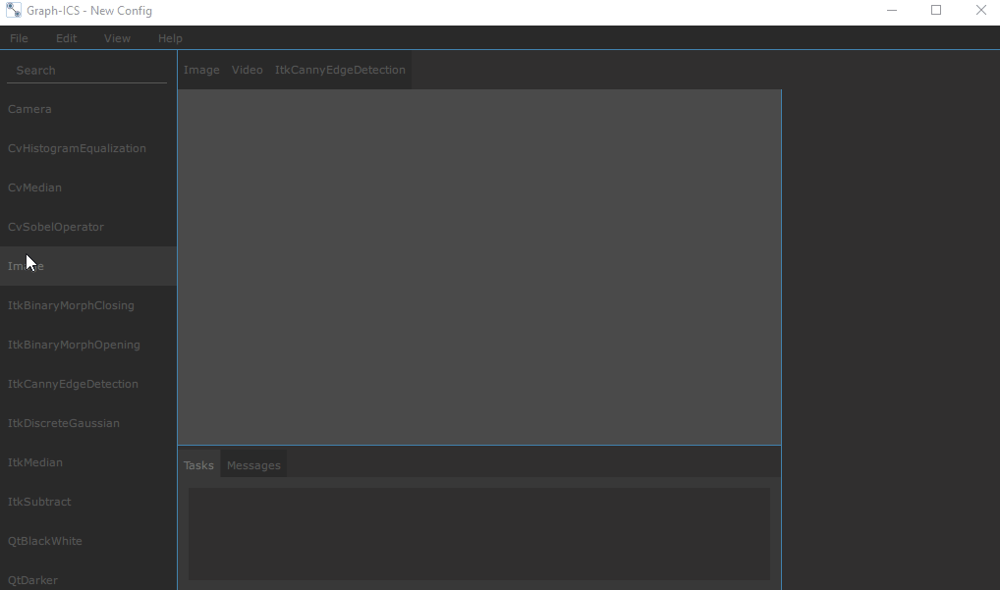
</center>

- ### Remove nodes

Nodes can be removed by right-clicking the node and selecting "Remove Node" from the context-menu. You can also remove nodes with the commands in the Menubar under the "Edit" tab (Keyboard Shortcuts are also available).

<center>
	
</center>

- ### Edit several nodes at once

If you want to edit several nodes you can select them by drawing a rectangle on the canvas with your mouse.
The selected nodes will be marked and you can perform different actions on them using the "Edit" menu.

- ### Manage your configuration

You can open and save a configuration of nodes via the "File" menu.

- ### Favoritesbar

Graph-ICS allows adding filters to the toolbar. To do so press and hold an Item in the Sidepanel and drag&drop it on the Favoritesbar.

<center>
	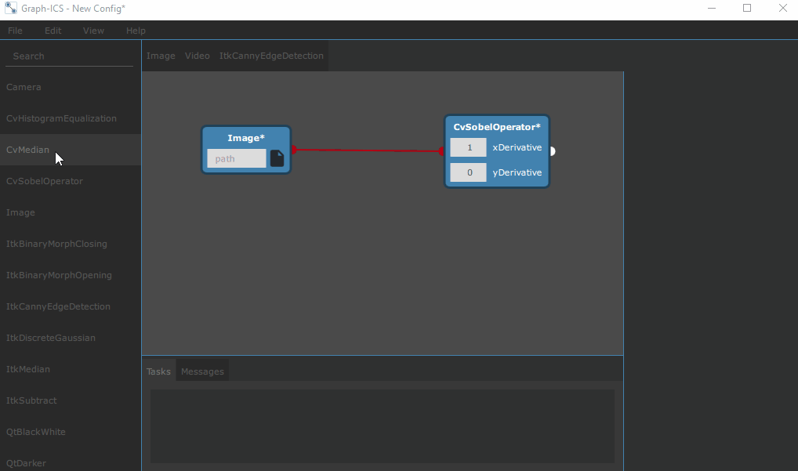
</center>

Create nodes in the same manner as using the Sidepanel

You can remove Nodes from the Favorites by selecting "Remove from Favorites" in the Context-Menu. You can rearrange the items in the Favoritesbar via drag&drop, by pressing and holding an item.

- ### Statusbar

The Statusbar is made up of Tabs. The Tasks-Tab shows the list of queued node-processing Tasks.

<center>
	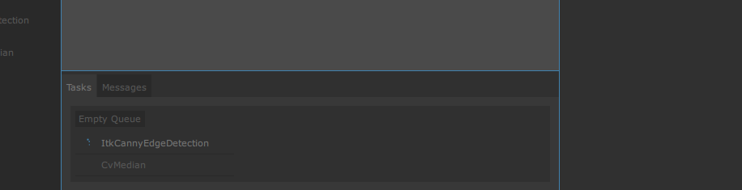
</center>

If you have queued a Task with a Camera or Video-Node as input, then the Videocontrols appear next to the first element in the Tasklist. You can Pause, Play or Stop the Video.

<center>
	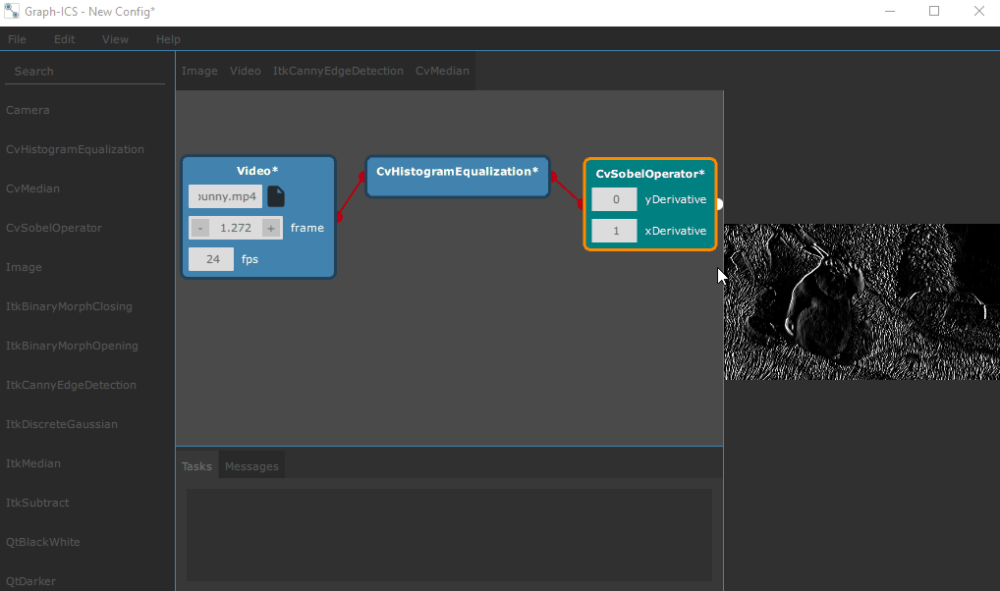
</center>

The Messages-Tab shows general messages to the user.

## Developer Guide

Graph-ICS supports to add your own filters. To create a new filter it is needed to create a filter class (the model) and register this class as a QML object. The following steps show this in detail based on the example *ItkMedian*.

### 1. Choose filter

- Go to the documentation page of the filter you want to implement (for OpenCv: https://docs.opencv.org/, for ITK: https://itk.org/Wiki/Main_Page or https://itk.org/ItkSoftwareGuide.pdf)
- Here is the documentation of our example filter: https://itk.org/Doxygen/html/classitk_1_1MedianImageFilter.html

### 2. Add a new filter class

- (Open the project in the Qt Creator)
- Right-click on "src/nodes/filter" and select "Add New..."
- Select "C++", "C++ Class" and click on "choose"
- Enter a class name, e.g. "ItkMedianFilter"
- Add Node as the Custom Base class and select "Add Q_OBJECT"
  
<center>
	
</center>

- Click "next", then "finish"
- Ignore CMake warning
- Right-click on the project root and select “Run CMake” (or in the Menu "Build/Run CMake")

### 3. Implement filter class

The structure of filter classes are quite similar. So you can orient on predefined filters. 

- Open the header file of your new filter:

```c++
#ifndef ITKMEDIANFILTER_H
#define ITKMEDIANFILTER_H
#include "node.h" // (1)

class ItkMedianFilter : public Node // (2)
{
    Q_OBJECT // (3)

public:
    explicit ItkMedianFilter();
    virtual ~ItkMedianFilter() {}

    virtual bool retrieveResult(); // (4)
};
#endif // ITKMEDIANFILTER_H
```

- Pay attention to the following steps:

	(1) Include "node.h".

	(2) Inherit from the Node class.
    
	(3) Use Q_OBJECT macro with the class.

	(4) retrieveResult() is a pure virtual function of the base class. So it must be implemented and it shall contain the actual filter functionality.

- Now go to the source file of the new filter.
- Filter can have different Attributes. Most of the time a filter needs integer or double values. Implement the Constructor and add Attributes to the Attributesystem like shown below. Check out the folder "src/nodes/attributes" for more possible attributes. Please read the commented lines carefully!
```c++
ItkMedianFilter::ItkMedianFilter()
{
    // register an attribute using the member function
    // the first argument represents the attributename (used for accessing)
    // !!!***********************************************!!!
    // never start with Capital Letter or the automatic QML View
    // creation will fail
    // !!!***********************************************!!! 
    // the second argument is the pointer to the actual attribute class
    // every attribute has a Constructor where you need to specify your attribute constraints
    registerAttribute("radiusX", new NodeIntAttribute(1, 50, 0, 1    );
    registerAttribute("radiusY", new NodeIntAttribute(1, 50));
    // some Attributes also create accesible constraints for their constraint values
    // see NodeRangeAttribute, these constraints are accessed by the 
    // corresponding QML Attribute    
    // specify the NodeName (usually: Libraryname + Filtername)
    m_nodeName = "ItkMedian";    
    // you can also add more or less than 1 input Port (default is 1)
    // m_inPortCount = 42; 
	// adds 42 inputPorts to the node (not recommended)
    // if you specify the membervariable m_warningMessage, a warning will show when
    // creating the Node
    // m_warningMessage = "very dangerous node (can bite)"
}
```

- Implement retrieveResult() by following the next code listing:

```c++
bool ItkMedianFilter::retrieveResult()
{
    // if the node has no predecessor return (no input node connected)
    if (m_inNodes.size() < 1) {
        return false;
    }
    else {
        try {
            // get the result of the predecessor node
            // and save it in the own m_img member
            m_img = m_inNodes[0]->getResult();
            // return if the predecessor result is empty
            if(!m_img.isSet()){
                return false;
            }
            // concrete Filter implementation

            // get the concrete image using the function provided by GImage
           	itk::Image<unsigned char, 2>::Pointer itkImage = m_img.getItkImage();

            // Itk specific definitions
            constexpr unsigned int imageDimension = 2;
            using InputImageType = itk::Image<unsigned char, imageDimension>;
            using OutputImageType = itk::Image<unsigned char, imageDimension>;
            using FilterType = itk::MedianImageFilter<InputImageType, OutputImageType>;

            FilterType::Pointer filter = FilterType::New();
            InputImageType::SizeType indexRadius;
            // retrieve the Attribute value using the function getAttributeValue
            // .toInt() needs to be used because the Attribute is an integer
            // getAttributeValue returns a QVariant Type (see Qt documentation)
            indexRadius[0] = getAttributeValue("radiusX").toInt(); // radius along x
            indexRadius[1] = getAttributeValue("radiusY").toInt(); // radius along y
            filter->SetRadius( indexRadius );

            filter->SetInput(itkImage);
            filter->Update();
            itkImage = filter->GetOutput();
            // after the filtering is processed set the Image to m_img
            m_img.setImage(itkImage);

        } catch (int e) {
            qDebug() << "ItkMedianFilter. Exception Nr. " << e << '\n';
            return false;
        }
    }
    return true;
}
```

- The setter function for the Attributes is implemented in "node.cpp" and can be overwritten if special behaviour is needed

### 4. Register filter as QML Object

- In "main.cpp" include the header of the implemented filter. Also add the following code to the main function:
  
```c++
// !!! use the same string as m_nodeName as the argument to register the node !!! 
nodeProvider->registerNode<ItkMedianFilter>("ItkMedian");
```

### 5. Create your own Node-View

- Graph-ICS creates the Node-View (display in canvas) automatically, using the values and Attributes specified in the Constructor of the filterclass, but also gives you the freedom to implement your own View
- For Details on how to hardcode the View check out the "qml/nodes/ItkCannyEdgeDetectionFilter.qml" and "qml/nodes/VideoNode.qml" files