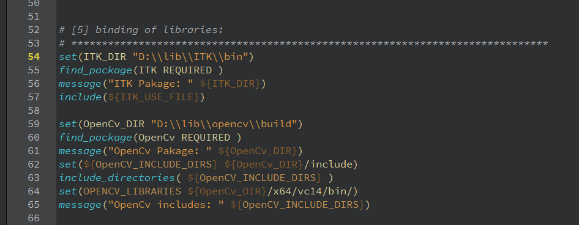

Graph-ICS
===

## Table of Contents
1. [Overview](#overview)
2. [Installation](#installation)
3. [User Guide](#user-guide)
4. [Developer Guide](#developer-guide)

## Overview

    

Graph-ICS is a software for image processing. It supports image filters using **[ITK](https://itk.org/)** and **[OpenCV](https://opencv.org/)**. Its user interface is based on  **[QML](http://doc.qt.io/qt-5/qtqml-index.html)** and **[QtQuick](http://doc.qt.io/qt-5/qtquick-index.html)**.

The user interface is basically divided into two parts: the canvas (drawing area) on the left and the viewer on the right. Via drag&drop  from the toolbar above you can draw nodes on the canvas. Nodes represent images or filters. 

Nodes can be connected to each other. So they can have input nodes on their left side and output nodes on their right side. Usually there is one image node input for a chain of filters.

The picture below shows an example:

	

Via double-click on a node the corresponding output image will be calculated and shown on the right side by the viewer.

So if you double-click in the example below on "CVMedian" first the image "brain.jpg" will be  processed by a black/white filter, then by an (OpenCV) median filter and then the corresponding output image will be shown in the viewer. Otherwise if you double-click on "BlackWhite" only the black/white filter will be applied:

	

## Installation

With a successfully execution of the Installations guide steps you should be able to build and run the project.

**Note:** The project has been recently renamed from "GraphMIC" to "Graph-ICS". The screenshots shown in the installation guide may contain the old name of the project.  

Required components:

- Microsoft Windows 7, 8 or 10
- Visual Studio 2015 or Visual Studio 2017
- CMake
- Qt 5.11.0 with Qt Creator
- ITK
- OpenCV 3.x

**Please read the instructions carefully and pay attention to the complementary images.**

### Contents

1. Download Project from GitHub
2. Install Debugging Tools from the Windows SDK
3. Install Visual Studio 
4. Install CMake 
5. Install Qt 
6. Install and Build ITK 
7. Install and Build OpenCV   
8. Configure the Project (Graph-ICS)
9. (Optional) Change CMakeLists.txt file

### 1. Download the Project from GitHub
1.1. Go to https://github.com/Graph-ICS/Graph-ICS   

1.2. Click on "Clone or Download"  

1.3. Click on "Download ZIP"  

1.4. Unpack the file and save it at the project path of your choice, e.g. "D:\Graph-ICS"

### 2. Install Debugging Tools from the Windows SDK

Windows SDK contains a CDB Debugger. You will need it in case you want to debug the application. 

2.1. Go to https://www.microsoft.com/en-us/download/details.aspx?id=8279 in case you use Windows 7.

2.2. Click "Download".

2.3. Run the installer.

2.4. Read the licence and select "I Agree".

2.5. Click next.

2.6. Select option "Debugging Tools for Windows" as shown here and click next:

	

### 3. Install Visual Studio

3.1. Go to https://visualstudio.microsoft.com/vs/community/
    
3.2. Ensure that "Windows" is selected then click download to download the installer:

	

3.3. Go to the downloads folder, select the installer and run it as administrator.

3.4. Click continue.
    
3.5. Wait for the download, then select "Desktop development using C++" and click "Install":

	

3.6. Restart you computer as requested after the installation.

### 4. Install CMake

4.1. Go to https://cmake.org/download/

4.2. Select installer of latest release, e.g. "cmake-3.13.4-win64-x64.msi"

4.3. Start the installer and follow its instructions.

4.4. Select "Add CMake to the system PATH for all users":

	

  

4.5. Finish setup.

### 5. Install Qt

5.1. Go to https://www.qt.io/download, select "Go open source" and then click "Download"

5.2. Run the installer, click on next, then skip, click next.

5.3. Select the path where you want to install Qt, e.g. "C:\Qt". Click next.

5.4. Select the components you want to install, the ones you need are:

- Below "Qt 5.11.0": select "MSVC 2017 64-bit"
- Below "Developer and Designer Tools": "Qt Creator 4.8.1 CDB Debugger Support"

5.5. Finish the installation.

5.6. Setting up the QT Creator (NMake Generator)

- Open QtCreator, go to "Tools" and click "Options":

	

- Select "Kits".

- Select "Desktop Qt 5.11.0 MSVC 2017 64bit" and click "Clone":

	

- Select the cloned kit, go to "CMake generator" and click "Change...":

	

- Select "NMake MakeFiles JOM" as generator, and "CodeBlocks" as extra generator, then click "OK":

	

- If you want to debug make sure you select the correct path to the debugger like on the following picture:

	

- Click "OK" and close the Qt Creator.

5.7. Add Qt Creator, e.g. "C:\Qt\Tools\QtCreator\bin", to your system path. [Here](https://www.nextofwindows.com/how-to-addedit-environment-variables-in-windows-7) is described how that works in general.

### 6. Install and Build ITK

6.1. Go to https://github.com/InsightSoftwareConsortium/ITK

- Select the branch “release”. 
- Click on"Clone or download", 
- Click on"Download ZIP"
    
6.2. Create a target folder for ITK. We recommend "D:\lib\ITK".

**Note:** If you choose another folder you need adjust a CMake file later on.

**Note:** Do not choose a path wich is too long because CMake paths are restricted to 50 characters by default.

- Unzip the downloaded file in your ITK folder, so a subfolder “ITK-release” will be created.

- In your ITK folder create a subfolder "bin".

6.3. Open CMake GUI

- On “Where is the source code” set the path to the “ITK-release” folder.

- On “Where to build the binaries” set the path to the "bin" folder.

	

- Click on "Configure".

- A window will pop up. Specify the generator with “Visual Studio 15 2017 Win64” and click "Finish":

	

- (You can ignore the error about "KWStyle".) Uncheck "BUILD_TESTING".

- Click on "Configure" again until there is no more red value, i.e. changed value.

- Click "Generate".

6.5. Run Visual Studio as administrator and open the generated project in your bin folder.

6.6. On Visual Studio

- Wait until the project is initialized. (See blue progress bar below)

- Right-click on "CMakePredefinedTargets/ALL_BUILD" and click "build". It will take several minutes to complete the process.

- Make sure you make this step for both "Debug" and "Release" configuration.

### 7. Install and Build OpenCV:

To install and build OpenCV you can download and use the pre-compiled binaries and follow 7.1 (which is recommended) or you can build the binaries by yourself following 7.2 (wich takes much time).

7.1. USING THE PROVIDED MSVC BINARIES:

- Go to https://opencv.org/releases.html

- Select "Win pack" of the **latest 3.x.x** version:

	

- Open the download folder and start the just downloaded "opencv....exe".

- Set the path where you want to extract the package. We recommend "D:\lib".

- Extract the files.
    
7.2. BUILDING OF OPENCV BINARIES WITH MSVC ON YOUR OWN:
Follow the steps in section 6 and consider the following changes:

- For 6.1 download OpenCV from https://opencv.org/releases.html, select "Sources" of the latest 3.x.x version.

- For 6.2 we recommend the target folder "D:\lib\opencv". Unzip the downloaded file in that folder. The created subfolder is the source folder in 6.3.

    
### 8. Configure the Project (Graph-ICS)

8.1. If ITK or OpenCV is not installed at the default path which is "D:\lib\ITK\bin" and "D:\lib\opencv\build":

- Open "CMakeLists.txt" in the project path:

	

  

- Search for "ITK_DIR" and adjust the set path.

- Search for "OpenCv_DIR" and adjust the set path.
 
- Save and close the file.

8.2. Open Qt Creator and click "open project" on the "Welcome" tab.

8.3. Select "CMakeLists.txt" in the project path.

8.4. Of the shown project configurations select the kit you cloned in step 5.6 and click "Details". Then select "Default", "Debug" and "Release" and set a bin folder (output folder), e.g. "D:\Graph-ICS\bin":

	

8.5. Click “configure project”

## User Guide

- ### Add an image

In order to add an image you must create an "Image" node. To do so, go to the combobox and select the item "Image" in the list view (1). By Drag&Drop from the "Select" Button the node will be created where you release the mouse button (2).
You can either write the path to the image you want to edit in the text field or select it drom you file explorer by clicking the file symbol (3).

	

- ### Add and apply filters

If you have created an image you can apply a filter on it. Create any filter node as you created the image node. Then connect your image (or your previous filter) with the filter by drawing an edge from the (right) output port to a filter's (left) input port. Double-click on the filer and the filtered image will be shown in the viewer. This can also be done if you right-click on the node and select "Show Image" its context menu.

	

- ### Remove nodes

Right-click on a node and select "Remove Node".

	

- ### Edit several nodes at once

If you want to edit several nodes you can select them by drawing a rectangle on the canvas with your mouse.

	

The selected nodes will be marked and you can perform different actions on them using the "Edit" menu.

	

- ### Manage your configuration

You can open and save a configuration of nodes via the "File" menu. It is also possible to select an image from your filesystem to show it the viewer.

	

These options also works via the context menu of the canvas:

	

...or of the viewer:

	

- ### Favorites toolbar

Graph-ICS allows adding filters to the toolbar. To do so go to the combobox, right click on a node and select "Add To Favorites".

	

Via Drag&Drop from a node in the toolbar a corresponding node will be created in the canvas.

	

You can delete an item from the toolbar via its context menu item "Remove From Favorites" (1).
Via context menu you can also rearrange items within the toolbar by selecting "Move Item" (2). So you can drag an item with your mouse inside the toolbar.

	

## Developer Guide

Graph-ICS is basically following a MVC architecture. is divided on two components.

The QtQuick framework includes the QML declarative scripting language. QML Objects are useful for the interaction with the user, the Graph-ICS user interface is conceded on QML, in Graph-ICS it makes possible to:

- Represent filters and images using nodes the user can drag on the Editor
pane (using customs objects)  
- Create a data flow between the created nodes connecting them using edges.
Interact to mouse and key events like user inputs.  
- Allow the user to change the filter values on a filter node and apply the filter
with these new values by clicking on it.  

Each filter node represents a C++ Class defined as **\<ClassName\>Filter** , each filter
class is registered as QML Object on the main function so it can be instantiated as
QML Object. For more information go [here](http://doc.qt.io/qt-5/qtqml-cppintegration-exposecppattributes.html)

A typical filter class declaration will be showed on the Figure 1 : Typical filter
declaration, here the ItkDiscreteGaussianFilter.

- The **Q_OBJECT** macro tells the compiler this class implements its owns
signals and slots, so the meta object compiler moc need to run at first  
- The **Q_PROPERTY** macro will be used to tell the compiler the variables to be
read through a given get method, write through a given set method and the
changes will be notified using the given method next the NOTIFY macro  
- The **Q_INVOKABLE** macro allows functions to be called from QML objects  

	

*Figure 1 : Typical filter declaration, here the ItkDiscreteGaussianFilter class*

Graph-ICS supports to add your own filters. To create a new filter it is needed to create a filter class, register this
class as a QML object and add it into the toolbar to make it visible for the user. The following steps show this in detail based on the example *ITKMedianImageFilter*.

### 1. Choose filter

- Go to the documentation page of the filter you want to implement (for OpenCv: https://docs.opencv.org/, for ITK: https://itk.org/Wiki/Main_Page or https://itk.org/ItkSoftwareGuide.pdf)
- Here is the documentation of our example filter: https://itk.org/Doxygen/html/classitk_1_1MedianImageFilter.html

### 2. Add a new filter class

- (Open the project in the Qt Creator)
- Right-click on "Sources/Filter" and select "Add New...":

	

- Select "C++ Class" and click on "choose".
- Enter a class name, e.g. "ItkMedianFilter".
- Click "next", then "finish".
- Ignore CMake warning.
- Right-click on project node and select “Run CMake”:

	

### 3. Implement filter class

The structure of filter classes are quite similar. So you can orient on predefined filters. 

- Open the header header file of your new filter:

	

- Pay attention to the following steps:

	1) Include "node.h".
	2) Inherit from the Node class.
	3) Use Q_OBJECT macro with the class.
	4) Declare member variables per input parameter of the filter.
	5) Declare a pair of get and set method per input parameter.
	6) Add a Signal per input parameter.
	7) Add a Q_PROPERTY per input parameter referring member variable, get method, set method and signal. This is needed for the interaction between QML view and C++ model.
	8) retrieveResult() is a pure virtual function of the base class. So it must be implemented and it shall contain the actual filter functionality.

### 4. Defining the filter class in the source file

- Go to the source file of your class.
- Define your constructor giving a default value for each input parameter (Look
at the documentation).
- Define the get and sets methods, make sure you call the function
cleanCache() on the set methods.

	

- Override the virtual function retrieveResult() as follows:  
Consider the Figure 3 : itkmedianfilter.cpp, definition of retrieveResult(), the new class
needs also to overwrite the virtual function node::retrieveResult().

	

*Figure 3 : itkmedianfilter.cpp, definition of retrieveResult()*

The filter will be implemented on the Try block. The definition of the
ItkMedianFilter::retrieveResult() function follows these 6 steps:

1. The first If clause will check if there is an input, so this input is an QPixmap, we
convert it on a QImage format to access to its pixels values. (line 37)
2. The second clause will check if the m_img variable is set (this variable holds the
input image), in this case the current value will be loaded. (line 38)
3. On the Try block, we get the image input, prepare the ITK filter with the proper
parameters: InputImageType, OutputImageType and ImageDimension. (line
43 - 50 )
4. We use the ImageConverter::itkImageFromQImage(TargetITKImage,
FromQImage) function to convert the input QImage to a ITK Image. (line 51 )
5. We create the ITK::MedianImageFilter pointer using the given InputImageType
and OutputImageType parameters from step 3 (line 53 - 54), and set the values
given from the user. (line 56 - 61)
6. The ITK Image output from filter will be converted to an QImage to
continue the data flow. (line 63)
7. In order to continue the flow between the nodes, we need to convert out filter
output to an QImage, so we call the
ImageConverter::qImageFromITKImage(TargetQImage, FromITKImage)
function. (line 65)
8. In case an exeption occurred, then it will be catched on the catch block. (line 69-72)
9. If the Filter was correct implemented, so the function retrieveResult() returns the
flag true.(line 74)  

Take care of the valid parameter types and values for your filter, the Figure 3 :
itkmedianfilter.cpp, definition of retrieveResult() shows the position where this
parameters might change for each ITK filter. The number 1 represent the input pixel
types and image dimension, the number 2 represents the ITK filter parameters.

### 5. Register the class as QtQuick QML Object

Once we have already prepared the class following successfully the step 2 , so we
should register this class on the main.cpp file as QML Type, it will make possible to
use this class on QML files declaring it as normal QML Object.

So, we will need to add the following line to the code (take care of the used name
convetion):

	

The syntax for this function should be as follows:

	

Whit X, Y as the package version. We will always use the package version X= 1 and
Y = 0. Make sure you include your class header file, so we must add the line:

	

### 6. Create your QML file

In this step you should create a QML file on the QML project folder to be able to use
our filter class in our user interface.

- Right click on the QML/file folder, select Add new
- Select Qt, and QML File as the following image

	

We turn into the QML coding, so we create a new file to hold the created class on the
QML folder, we name this file ITKMedian.qml, like the name of the filter you want to
create.

	

*Figure 4 : Importing the needed components*

We add the showed import packages like on Figure 4 : Importing the needed
components to the top of the QML file.

qmlRegisterType< ItkMedianFilter >(" Model.ItkMedian ", 1 , 0 ," ItkMedian ");

qmlRegisterType< ClassName >(" Model.FilterName ",X,Y," FilterName ");

#include "itkmedianfilter.h"

For your class you need to change the line 6 , and import the filter name you
registered before on the step 2.5, the numbers following the import package are
taken as the package version.

If the Filter needs 2 inputs, you must instantiate an QML Object from the class
GFilter2Ports.qml as parent, so just write GFilter2Ports on line 8.

If the Filter needs 3 inputs you must instantiate the parent GFilter 3 Ports.qml, so
write GFilter 3 Ports.

If your filter just need one input, so use the GFilter object as you see on the Figure 5 :
Filter object on QML..

For the median filter we just need one input, this will contain all the needed
implementations for a basic node (dragging, connections through edges...), so we
use the GFilter object.

Inside this GFilter Object, you need to create an instance of your filter class (lines
14 - 16 ) with the id: model and a property alias to the model (line 1 8 ) like on the
Figure 5 : Filter object on QML.

	

*Figure 5 : Filter object on QML.*

Create a Label to hold the filter name, for us “ITKMedian”.

Create a Label and a TextField for each input parameter your filter needs, the Label
just holds the parameter name and the TextField will contain the parameter value,
make sure you give each TextField a valid id.

For us, the ItkMedian needs two inputs: RadiusX and RadiusY, so we created the
corresponding labels and textfields.

	

*Figure 6 : TextField for an input parameter*

Consider the Figure 6 : TextField for an input parameter, for each input parameter,
you should create a TextField like this for each input parameter, it is recommended
to use the parameter name as id (line 29), its text property should hold the
parameter value from your filter class model (line 42), the onTextChanged event
should be implemented changing the model parameter every time the TextField text
changes (Lines 45- 47 ).

	

*Figure 7 : Parameter name “RadiusY”, represented with a Label*

The parameter name for the TextField radius, will be showed using a Label, see
Figure 7 : Parameter name “RadiusY”, represented with a Label.

	

*Figure 8 : Designer view of the ITKMedianFilter.qml*

If you click on the left pane, on the Design tab you can see the result of your code,
like on the Figure 8 : Designer view of the ITKMedianFilter.qml.
The design does not look ecaxtly like this in the programm but you can see the size of the node and the position of the labels. 

The last step consist on implementing two functions saveNode() and loadNode() its
implementation are same for each filter, but the ids might vary. If the filter you want
to implement have no input parameters, you don’t need to implement these
functions.

	

*Figure 9 : ITKMedianFilter.qml, functions saveNode() and loadNode()*

Consider the Figure 9 : ITKMedianFilter.qml, functions saveNode() and loadNode(),
the lines 84- 87 und 90 are same for each filter node, the next lines 88-89 will vary
depending on the input parameters and the TextField id’s.

On the function loadNode(), we will read the values from the saved nodeData JSON
object and load it into the TextFields representing the saved configuration values.

### 7. Update the toolbar buttons

On the GToolBar.qml go to the ListModel and add your filter as a new ListElement
object, see Figure 10 : ListModel and ListElements.

The name of the new ListElement should be exactly the name of the QML file you
created without the .qml ending.

	

*Figure 10 : ListModel and ListElements*
